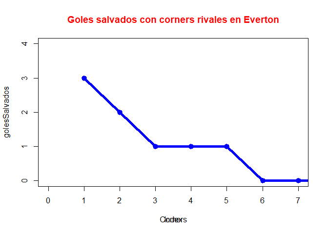

Untitled
================

\#Se instalan las librerias y se lee el archivo

``` r
library(quanteda)
```

    ## Package version: 2.1.2

    ## Parallel computing: 2 of 12 threads used.

    ## See https://quanteda.io for tutorials and examples.

    ## 
    ## Attaching package: 'quanteda'

    ## The following object is masked from 'package:utils':
    ## 
    ##     View

``` r
library(dplyr)
```

    ## 
    ## Attaching package: 'dplyr'

    ## The following objects are masked from 'package:stats':
    ## 
    ##     filter, lag

    ## The following objects are masked from 'package:base':
    ## 
    ##     intersect, setdiff, setequal, union

``` r
library(tidyverse)
```

    ## -- Attaching packages --------------------------------------- tidyverse 1.3.0 --

    ## v ggplot2 3.3.3     v purrr   0.3.4
    ## v tibble  3.1.0     v stringr 1.4.0
    ## v tidyr   1.1.3     v forcats 0.5.1
    ## v readr   1.4.0

    ## -- Conflicts ------------------------------------------ tidyverse_conflicts() --
    ## x dplyr::filter() masks stats::filter()
    ## x dplyr::lag()    masks stats::lag()

``` r
library(utf8)
library(ggplot2)

setwd("C:/Users/cvill/OneDrive/Escritorio/RStudio Projects/Actividad 0")
datos <- read_csv("Primer_Tiempo2020.csv", col_names = TRUE)
```

    ## 
    ## -- Column specification --------------------------------------------------------
    ## cols(
    ##   .default = col_double(),
    ##   torneo = col_character(),
    ##   equipo = col_character(),
    ##   id_partido = col_character(),
    ##   partido = col_character(),
    ##   fasepartido = col_character(),
    ##   local = col_logical(),
    ##   tiempo = col_character()
    ## )
    ## i Use `spec()` for the full column specifications.

\#Se hace una limpieza de datos y se eliminan las columnas que no sirven
actualmente

``` r
datos <- datos[,!(colnames(datos) %in% c("torneo","id_partido","fasepartido", "tiempo"))]
```

\#Se decide las columnas a utilizar y se hace el filtro de columnas

``` r
arco <- datos[order(datos$golesSalvados, decreasing = TRUE),]
arco <- arco[,colnames(datos) %in% c("equipo","partido","local","goalsConceded", "cornerTaken", "penaltyConceded", "penaltySave", "golesSalvados")]
arco
```

    ## # A tibble: 130 x 8
    ##    equipo  partido   local goalsConceded cornerTaken penaltyConceded penaltySave
    ##    <chr>   <chr>     <lgl>         <dbl>       <dbl>           <dbl>       <dbl>
    ##  1 Univer~ Uni<f3>n~ FALSE             1           2               0           0
    ##  2 Deport~ Uni<f3>n~ FALSE             0           0               0           0
    ##  3 Deport~ Deportes~ TRUE              0           0               0           0
    ##  4 Uni<f3~ Universi~ FALSE             1           0               0           0
    ##  5 Coquim~ Uni<f3>n~ FALSE             1           2               0           0
    ##  6 Santia~ O'Higgin~ FALSE             1           5               1           0
    ##  7 Everton Universi~ FALSE             0           1               0           0
    ##  8 Uni<f3~ Uni<f3>n~ TRUE              1           5               0           0
    ##  9 Uni<f3~ Uni<f3>n~ TRUE              0           2               1           1
    ## 10 Univer~ Santiago~ FALSE             0           2               0           0
    ## # ... with 120 more rows, and 1 more variable: golesSalvados <dbl>

\#Nos enfocamos en el equipo everton y se elimina la columna equipo

``` r
everton <- filter(arco, equipo == "Everton")
everton <- everton[,!(colnames(everton) %in% c("equipo"))]
everton
```

    ## # A tibble: 8 x 7
    ##   partido            local goalsConceded cornerTaken penaltyConceded penaltySave
    ##   <chr>              <lgl>         <dbl>       <dbl>           <dbl>       <dbl>
    ## 1 Universidad de Ch~ FALSE             0           1               0           0
    ## 2 Uni<f3>n Espa<f1>~ FALSE             0           2               0           0
    ## 3 Everton vs Uni<f3~ TRUE              0           1               0           0
    ## 4 Everton vs Coquim~ TRUE              0           4               0           0
    ## 5 Cobresal vs Evert~ FALSE             1           3               0           0
    ## 6 Everton vs Univer~ TRUE              1           3               0           0
    ## 7 Everton vs La Ser~ TRUE              0           3               0           0
    ## 8 Deportes Iquique ~ FALSE             2           2               1           0
    ## # ... with 1 more variable: golesSalvados <dbl>

\#Se busca los maximos de goles salvados en el equipo de everton

``` r
everton_goles_salvados <- c("Max goles salvados everton", max(everton$golesSalvados))
everton_goles_salvados
```

    ## [1] "Max goles salvados everton" "3"

\#Se realiza el grafico para buscar la relación visual entre goles
salvados y la cantidad de corners realizados al equipo Everton en el
torneo

``` r
attach(everton)
plot(golesSalvados, type="o", col="blue",lwd=5, ylim=c(0,4),xlim=c(0,7))
     title(xlab="Corners", )
title(main="Goles salvados con corners rivales en Everton", col.main="red", font.main=2)
```

<!-- -->
