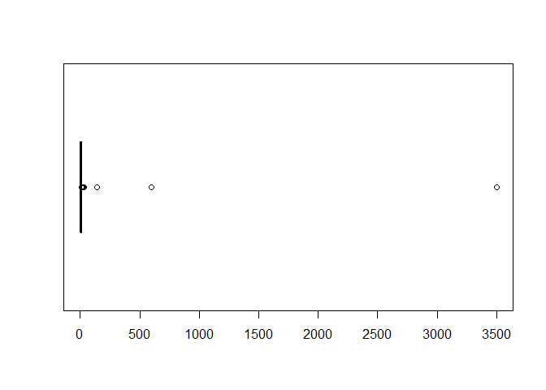
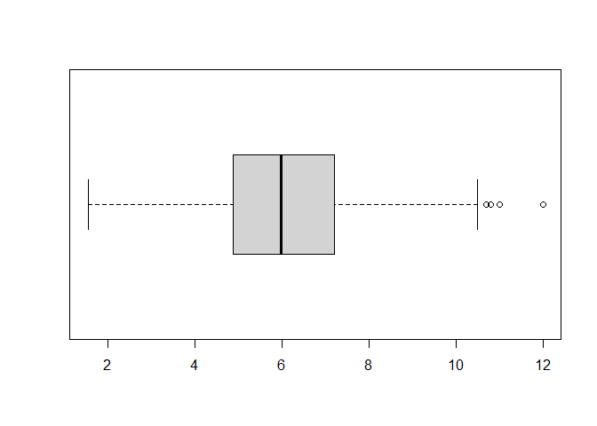
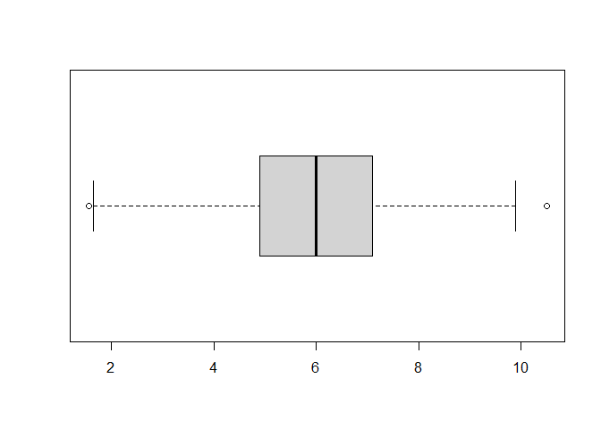
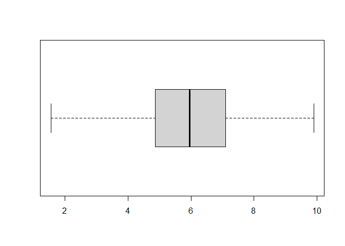
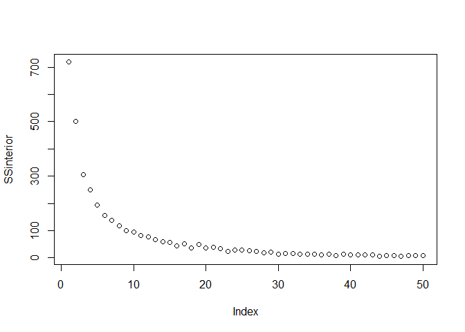
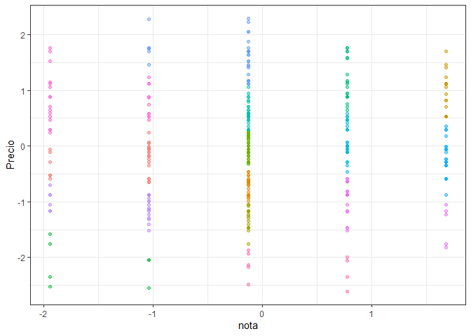
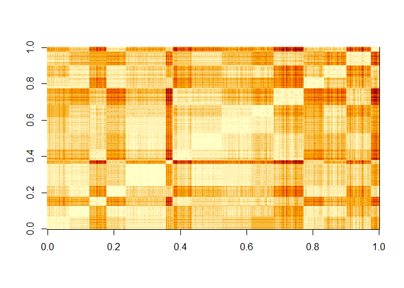
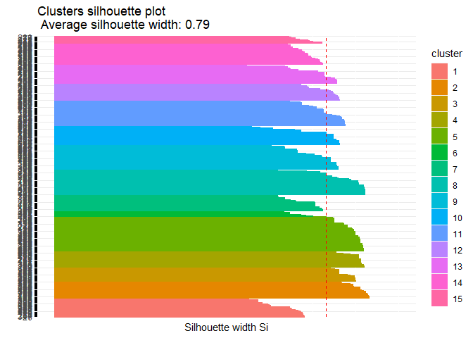
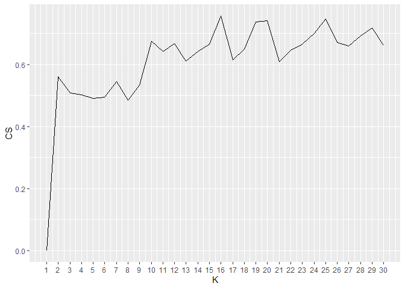
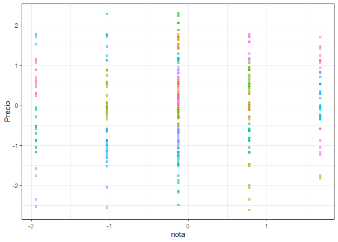

Analisis de clustering
================

Actividad - Ayudantía 5 Realizar análisis de clustering (K-means,
incluye preprocesamiento de la data) e índices de evaluación para el
archivo “sandwiches.csv” tomando las columnas de nota y precio. Hacer
análisis para diferentes K y/o medidas de distancia para que vean cómo
se comporta el clustering (En caso de tener algún problema con ese csv,
pueden utilizar el csv de Pokémon también para la actividad)

``` r
knitr::opts_chunk$set(echo = TRUE)
```

# 0. LIBRERÍAS

Se utilizaron los siguientes paquetes para las funciones que ayudaron en
el análisis realizado.

``` r
library(tidyverse)
```

    ## -- Attaching packages --------------------------------------- tidyverse 1.3.1 --

    ## v ggplot2 3.3.3     v purrr   0.3.4
    ## v tibble  3.1.1     v dplyr   1.0.5
    ## v tidyr   1.1.3     v stringr 1.4.0
    ## v readr   1.4.0     v forcats 0.5.1

    ## -- Conflicts ------------------------------------------ tidyverse_conflicts() --
    ## x dplyr::filter() masks stats::filter()
    ## x dplyr::lag()    masks stats::lag()

``` r
library(readr)
library(datasets)
library(factoextra)
```

    ## Welcome! Want to learn more? See two factoextra-related books at https://goo.gl/ve3WBa

``` r
library(flexclust)
```

    ## Loading required package: grid

    ## Loading required package: lattice

    ## Loading required package: modeltools

    ## Loading required package: stats4

``` r
library(cluster)
```

# 1. PREPARACIÓN DE LOS DATOS

# 1.1 Importación de datos

``` r
base <- read.csv("sanguchez.csv", sep=";")
```

# 1.2 Limpieza de datos

Solo se utilizaran las variables “nota” y “Precio” para el análisis de
clusters.

``` r
data <- select(base, nota,Precio)
data <- na.omit(data)
head(data)
```

    ##   nota  Precio
    ## 1    3 $5.210.
    ## 2    3  $7.000
    ## 3    4  $7.290
    ## 4    4  $8.690
    ## 5    4  $4.900
    ## 6    3  $6.500

# 1.3 Transformación a Datos numéricos

Se cambia el tipo de variable para un mejor manejo de datos. “Precio”
era tipo char por lo que fue necesario utilizar la librería “readr” para
eliminar todos los caracteres que no fueran numéricos.

``` r
data2 <- data
data2$nota <- as.numeric(data2$nota)
data2$Precio <- parse_number(data2$Precio)
data2 <- na.omit(data2)
head(data2)
```

    ##   nota Precio
    ## 1    3   5.21
    ## 2    3   7.00
    ## 3    4   7.29
    ## 4    4   8.69
    ## 5    4   4.90
    ## 6    3   6.50

# 1.4 Boxplot

Se busca eliminar los datos atípicos de la variable “Precio” para un
análisis más certero.

``` r
boxplot(data2$Precio, horizontal = TRUE)
```

<!-- -->

``` r
boxplot.stats(data2$Precio)
```

    ## $stats
    ## [1]  1.55  4.95  6.25  7.80 12.00
    ## 
    ## $n
    ## [1] 400
    ## 
    ## $conf
    ## [1] 6.02485 6.47515
    ## 
    ## $out
    ##  [1]   17.0   15.0   18.0   12.9   14.5   22.0   18.0   18.0 3500.0   15.5
    ## [11]   23.0   15.0   28.0   19.0   20.0  600.0   14.6   14.9   15.0   14.0
    ## [21]   16.9   16.0   12.9   16.0   13.5   26.0  140.0   13.0   14.0   25.0
    ## [31]   17.0   22.0   14.0   18.0

``` r
data2 <- filter(data2, Precio < 12.9)
boxplot(data2$Precio, horizontal = TRUE)
```

<!-- -->

``` r
boxplot.stats(data2$Precio)
```

    ## $stats
    ## [1]  1.55  4.89  5.99  7.20 10.50
    ## 
    ## $n
    ## [1] 366
    ## 
    ## $conf
    ## [1] 5.799222 6.180778
    ## 
    ## $out
    ## [1] 12.0 12.0 11.0 10.7 10.8

``` r
data2 <- filter(data2, Precio < 10.7)
boxplot(data2$Precio, horizontal = TRUE)
```

<!-- -->

``` r
boxplot.stats(data2$Precio)
```

    ## $stats
    ## [1] 1.65 4.89 5.99 7.10 9.90
    ## 
    ## $n
    ## [1] 361
    ## 
    ## $conf
    ## [1] 5.806221 6.173779
    ## 
    ## $out
    ## [1] 10.50  1.55

``` r
data2 <- filter(data2, Precio < 10.5)
boxplot(data2$Precio, horizontal = TRUE)
```

<!-- -->

``` r
boxplot.stats(data2$Precio)
```

    ## $stats
    ## [1] 1.55 4.87 5.96 7.10 9.90
    ## 
    ## $n
    ## [1] 360
    ## 
    ## $conf
    ## [1] 5.774301 6.145699
    ## 
    ## $out
    ## numeric(0)

# 1.5 Escalamiento de datos

Se escalan los datos para que en el análisis, no exista una influencia
significativa entre variables

``` r
data3 <- scale(data2) %>% as_tibble()
data3 %>% summary()
```

    ##       nota             Precio        
    ##  Min.   :-1.9404   Min.   :-2.60410  
    ##  1st Qu.:-0.1307   1st Qu.:-0.65444  
    ##  Median :-0.1307   Median :-0.02212  
    ##  Mean   : 0.0000   Mean   : 0.00000  
    ##  3rd Qu.: 0.7741   3rd Qu.: 0.64533  
    ##  Max.   : 1.6790   Max.   : 2.28468

# 2. ANÁLISIS EXPLORATORIO DE LOS DATOS

# 2.1 Metodo del codo

Se analizará visualmente la evolución de la suma de cuadrados
inter-grupos en la medida que aumenta el valor de K

``` r
SSinterior <- numeric(50)
for(k in 1:50){
  modelo <- kmeans(data3, centers = k)
  SSinterior[k] <- modelo$tot.withinss
}
plot(SSinterior)
```

<!-- -->

No se puede decir con exactitud cuál es una buena cantidad de clusters
para el análisis pero para simplificar la situación se decidió tomar K =
15

``` r
data_kmeans <- kmeans(data3, centers = 15)

data3$clus <- data_kmeans$cluster %>% as.factor()

ggplot(data3, aes(nota, Precio, color=clus)) + geom_point(alpha=0.5, show.legend = F) + theme_bw()
```

<!-- -->

# 2.2 Inspección visual de clusters resultantes

``` r
tempDist <- dist(data2) %>% as.matrix()

index <- sort(data_kmeans$cluster, index.return=TRUE)
tempDist <- tempDist[index$ix,index$ix]
rownames(tempDist) <- c(1:nrow(data2))
colnames(tempDist) <- c(1:nrow(data2))

image(tempDist)
```

<!-- -->

# 2.3 Metodo estadístico de Hopkins e indice de correlación

``` r
res <- get_clust_tendency(data2, n=30, graph = FALSE)

tempMatrix <- matrix(0, nrow = nrow(data3), ncol = nrow(data3))
tempMatrix[which(index$x==1), which(index$x==1)]  <- 1
tempMatrix[which(index$x==2), which(index$x==2)]  <- 1
tempMatrix[which(index$x==3), which(index$x==3)]  <- 1
tempMatrix[which(index$x==4), which(index$x==4)]  <- 1
tempMatrix[which(index$x==5), which(index$x==5)]  <- 1
tempMatrix[which(index$x==6), which(index$x==6)]  <- 1
tempMatrix[which(index$x==7), which(index$x==7)]  <- 1
tempMatrix[which(index$x==8), which(index$x==8)]  <- 1
tempMatrix[which(index$x==9), which(index$x==9)]  <- 1
tempMatrix[which(index$x==10), which(index$x==10)] <- 1
tempMatrix[which(index$x==11), which(index$x==11)] <- 1
tempMatrix[which(index$x==12), which(index$x==12)] <- 1
tempMatrix[which(index$x==13), which(index$x==13)] <- 1
tempMatrix[which(index$x==14), which(index$x==14)] <- 1
tempMatrix[which(index$x==15), which(index$x==15)] <- 1

tempDist2 <- 1/(1+tempDist)
cor <- cor(tempMatrix[upper.tri(tempMatrix)],tempDist2[upper.tri(tempDist2)])

print(res)
```

    ## $hopkins_stat
    ## [1] 0.7966429
    ## 
    ## $plot
    ## NULL

``` r
print(cor)
```

    ## [1] 0.6350173

# 2.4 Indices de cohesión y separación

``` r
data3 <- apply(data3,2,as.numeric)
 
#Cohesion
withinCluster <- numeric(15)
for (i in 1:15){
  tempData <- data3[which(data_kmeans$cluster == i),]
  withinCluster[i] <- sum(dist2(tempData,colMeans(tempData))^2)
}
cohesion = sum(withinCluster)

print(c(cohesion, data_kmeans$tot.withinss))
```

    ## [1] 51.82008 51.82007

``` r
meanData <- colMeans(data3)
SSB <- numeric(15)
for (i in 1:15){
  tempData <- data3[which(data_kmeans$cluster==i),]
  SSB[i] <- nrow(tempData)*sum((meanData-colMeans(tempData))^2)
}
separation = sum(SSB)

print(separation)
```

    ## [1] 6652.844

# 2.5 Coeficiente de silueta

``` r
coefSil <- silhouette(data_kmeans$cluster,dist(data3))
summary(coefSil)
```

    ## Silhouette of 360 units in 15 clusters from silhouette.default(x = data_kmeans$cluster, dist = dist(data3)) :
    ##  Cluster sizes and average silhouette widths:
    ##        24        22        18        21        44         7        21        32 
    ## 0.6592912 0.8852271 0.8403428 0.8727128 0.8646729 0.6957661 0.7214213 0.8501490 
    ##        32        24        33        22        24        27         9 
    ## 0.7581146 0.7624817 0.7878975 0.7830911 0.7490286 0.7304462 0.7282410 
    ## Individual silhouette widths:
    ##    Min. 1st Qu.  Median    Mean 3rd Qu.    Max. 
    ##  0.5412  0.7245  0.8070  0.7891  0.8612  0.9132

# 2.6 Visualización de silueta de cada cluster

``` r
fviz_silhouette(coefSil) + coord_flip()
```

    ##    cluster size ave.sil.width
    ## 1        1   24          0.66
    ## 2        2   22          0.89
    ## 3        3   18          0.84
    ## 4        4   21          0.87
    ## 5        5   44          0.86
    ## 6        6    7          0.70
    ## 7        7   21          0.72
    ## 8        8   32          0.85
    ## 9        9   32          0.76
    ## 10      10   24          0.76
    ## 11      11   33          0.79
    ## 12      12   22          0.78
    ## 13      13   24          0.75
    ## 14      14   27          0.73
    ## 15      15    9          0.73

<!-- -->

# 2.7 Inspección visual evolución coeficientes de silueta frente a K

``` r
coefSil=numeric(30)
for (k in 2:30){
  modelo <- kmeans(data3, centers = k)
  temp <- silhouette(modelo$cluster,dist(data3))
  coefSil[k] <- mean(temp[,3])
}
tempDF=data.frame(CS=coefSil,K=c(1:30))

ggplot(tempDF, aes(x=K, y=CS)) + 
  geom_line() +
  scale_x_continuous(breaks=c(1:30))
```

<!-- -->

Como se puede apreciar, el valor más alto que llega a alcanzar el
coeficiente de silueta es cuando el número de clusters es 25, es decir K
= 25

``` r
data4 <- scale(data2) %>% as_tibble()
data4 %>% summary()
```

    ##       nota             Precio        
    ##  Min.   :-1.9404   Min.   :-2.60410  
    ##  1st Qu.:-0.1307   1st Qu.:-0.65444  
    ##  Median :-0.1307   Median :-0.02212  
    ##  Mean   : 0.0000   Mean   : 0.00000  
    ##  3rd Qu.: 0.7741   3rd Qu.: 0.64533  
    ##  Max.   : 1.6790   Max.   : 2.28468

``` r
data_kmeans2 <- kmeans(data4, centers = 25)

data4$clus <- data_kmeans2$cluster %>% as.factor()

ggplot(data4, aes(nota, Precio, color=clus)) + geom_point(alpha=0.5, show.legend = F) + theme_bw()
```

<!-- -->
