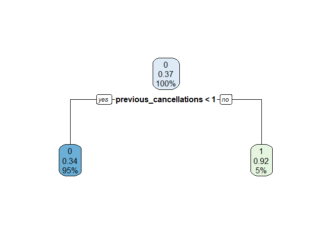

Untitled
================

## 0. LIBRERIAS

Se cargan las librerías que se utilizarán en el modelo

``` r
library(plyr)
library(ggplot2)
library(tidyverse)
```

    ## -- Attaching packages --------------------------------------- tidyverse 1.3.1 --

    ## v tibble  3.1.1     v dplyr   1.0.5
    ## v tidyr   1.1.3     v stringr 1.4.0
    ## v readr   1.4.0     v forcats 0.5.1
    ## v purrr   0.3.4

    ## -- Conflicts ------------------------------------------ tidyverse_conflicts() --
    ## x dplyr::arrange()   masks plyr::arrange()
    ## x purrr::compact()   masks plyr::compact()
    ## x dplyr::count()     masks plyr::count()
    ## x dplyr::failwith()  masks plyr::failwith()
    ## x dplyr::filter()    masks stats::filter()
    ## x dplyr::id()        masks plyr::id()
    ## x dplyr::lag()       masks stats::lag()
    ## x dplyr::mutate()    masks plyr::mutate()
    ## x dplyr::rename()    masks plyr::rename()
    ## x dplyr::summarise() masks plyr::summarise()
    ## x dplyr::summarize() masks plyr::summarize()

``` r
library(tidymodels)
```

    ## Registered S3 method overwritten by 'tune':
    ##   method                   from   
    ##   required_pkgs.model_spec parsnip

    ## -- Attaching packages -------------------------------------- tidymodels 0.1.3 --

    ## v broom        0.7.6      v rsample      0.1.0 
    ## v dials        0.0.9      v tune         0.1.5 
    ## v infer        0.5.4      v workflows    0.2.2 
    ## v modeldata    0.1.0      v workflowsets 0.0.2 
    ## v parsnip      0.1.6      v yardstick    0.0.8 
    ## v recipes      0.1.16

    ## -- Conflicts ----------------------------------------- tidymodels_conflicts() --
    ## x dplyr::arrange()   masks plyr::arrange()
    ## x purrr::compact()   masks plyr::compact()
    ## x dplyr::count()     masks plyr::count()
    ## x scales::discard()  masks purrr::discard()
    ## x dplyr::failwith()  masks plyr::failwith()
    ## x dplyr::filter()    masks stats::filter()
    ## x recipes::fixed()   masks stringr::fixed()
    ## x dplyr::id()        masks plyr::id()
    ## x dplyr::lag()       masks stats::lag()
    ## x dplyr::mutate()    masks plyr::mutate()
    ## x dplyr::rename()    masks plyr::rename()
    ## x yardstick::spec()  masks readr::spec()
    ## x recipes::step()    masks stats::step()
    ## x dplyr::summarise() masks plyr::summarise()
    ## x dplyr::summarize() masks plyr::summarize()
    ## * Use tidymodels_prefer() to resolve common conflicts.

``` r
library(discrim)
```

    ## 
    ## Attaching package: 'discrim'

    ## The following object is masked from 'package:dials':
    ## 
    ##     smoothness

``` r
library(caret)
```

    ## Loading required package: lattice

    ## 
    ## Attaching package: 'caret'

    ## The following objects are masked from 'package:yardstick':
    ## 
    ##     precision, recall, sensitivity, specificity

    ## The following object is masked from 'package:purrr':
    ## 
    ##     lift

``` r
library(readr)
library(pROC)
```

    ## Type 'citation("pROC")' for a citation.

    ## 
    ## Attaching package: 'pROC'

    ## The following objects are masked from 'package:stats':
    ## 
    ##     cov, smooth, var

``` r
library(naivebayes)
```

    ## naivebayes 0.9.7 loaded

``` r
library(kknn)
```

    ## 
    ## Attaching package: 'kknn'

    ## The following object is masked from 'package:caret':
    ## 
    ##     contr.dummy

``` r
library(rpart)
```

    ## 
    ## Attaching package: 'rpart'

    ## The following object is masked from 'package:dials':
    ## 
    ##     prune

``` r
library(rpart.plot)
```

## 1. BASE DE DATOS

Se carga la base de datos “hotel\_bookings”. Lo que se buscará en este
proyecto será determinar si la reserva del hotel será cancelada o no.

``` r
hotel_bookings <- read.csv("C:/Users/cvill/OneDrive/Escritorio/RStudio Projects/Ayudantia 11/hotel_bookings.csv")

glimpse(hotel_bookings)
```

    ## Rows: 119,390
    ## Columns: 32
    ## $ hotel                          <chr> "Resort Hotel", "Resort Hotel", "Resort~
    ## $ is_canceled                    <int> 0, 0, 0, 0, 0, 0, 0, 0, 1, 1, 1, 0, 0, ~
    ## $ lead_time                      <int> 342, 737, 7, 13, 14, 14, 0, 9, 85, 75, ~
    ## $ arrival_date_year              <int> 2015, 2015, 2015, 2015, 2015, 2015, 201~
    ## $ arrival_date_month             <chr> "July", "July", "July", "July", "July",~
    ## $ arrival_date_week_number       <int> 27, 27, 27, 27, 27, 27, 27, 27, 27, 27,~
    ## $ arrival_date_day_of_month      <int> 1, 1, 1, 1, 1, 1, 1, 1, 1, 1, 1, 1, 1, ~
    ## $ stays_in_weekend_nights        <int> 0, 0, 0, 0, 0, 0, 0, 0, 0, 0, 0, 0, 0, ~
    ## $ stays_in_week_nights           <int> 0, 0, 1, 1, 2, 2, 2, 2, 3, 3, 4, 4, 4, ~
    ## $ adults                         <int> 2, 2, 1, 1, 2, 2, 2, 2, 2, 2, 2, 2, 2, ~
    ## $ children                       <int> 0, 0, 0, 0, 0, 0, 0, 0, 0, 0, 0, 0, 0, ~
    ## $ babies                         <int> 0, 0, 0, 0, 0, 0, 0, 0, 0, 0, 0, 0, 0, ~
    ## $ meal                           <chr> "BB", "BB", "BB", "BB", "BB", "BB", "BB~
    ## $ country                        <chr> "PRT", "PRT", "GBR", "GBR", "GBR", "GBR~
    ## $ market_segment                 <chr> "Direct", "Direct", "Direct", "Corporat~
    ## $ distribution_channel           <chr> "Direct", "Direct", "Direct", "Corporat~
    ## $ is_repeated_guest              <int> 0, 0, 0, 0, 0, 0, 0, 0, 0, 0, 0, 0, 0, ~
    ## $ previous_cancellations         <int> 0, 0, 0, 0, 0, 0, 0, 0, 0, 0, 0, 0, 0, ~
    ## $ previous_bookings_not_canceled <int> 0, 0, 0, 0, 0, 0, 0, 0, 0, 0, 0, 0, 0, ~
    ## $ reserved_room_type             <chr> "C", "C", "A", "A", "A", "A", "C", "C",~
    ## $ assigned_room_type             <chr> "C", "C", "C", "A", "A", "A", "C", "C",~
    ## $ booking_changes                <int> 3, 4, 0, 0, 0, 0, 0, 0, 0, 0, 0, 0, 0, ~
    ## $ deposit_type                   <chr> "No Deposit", "No Deposit", "No Deposit~
    ## $ agent                          <chr> "NULL", "NULL", "NULL", "304", "240", "~
    ## $ company                        <chr> "NULL", "NULL", "NULL", "NULL", "NULL",~
    ## $ days_in_waiting_list           <int> 0, 0, 0, 0, 0, 0, 0, 0, 0, 0, 0, 0, 0, ~
    ## $ customer_type                  <chr> "Transient", "Transient", "Transient", ~
    ## $ adr                            <dbl> 0.00, 0.00, 75.00, 75.00, 98.00, 98.00,~
    ## $ required_car_parking_spaces    <int> 0, 0, 0, 0, 0, 0, 0, 0, 0, 0, 0, 0, 0, ~
    ## $ total_of_special_requests      <int> 0, 0, 0, 0, 1, 1, 0, 1, 1, 0, 0, 0, 3, ~
    ## $ reservation_status             <chr> "Check-Out", "Check-Out", "Check-Out", ~
    ## $ reservation_status_date        <chr> "2015-07-01", "2015-07-01", "2015-07-02~

## 2. FILTRACIÓN DE DATOS

Se toman las variables más importantes en este análisis para
introducirlos en los modelos regresión logística, Naive Bayes y KNN.

``` r
data <- select(hotel_bookings, 2,8:12,17:19,22,26)
```

## 3. TRANSFORMACIÓN DE TIPO DE DATOS

Se usará como referencia en el modelo la variable “Is\_canceled” para
modelar si es predecible o no el comportamiento.

``` r
data$is_canceled <- as.factor(data$is_canceled)
```

## 4. LIMPIEZA DE DATOS

Se borran todos los espacios vacíos y NAs de la base de datos y evitar
futuros errores en el análisis.

``` r
data[data == ""] <- NA
data <- na.omit(data)
```

## 5. SEPARACIÓN DE DATA

``` r
data_split <- initial_split(data, prop = 0.75)

train <- training(data_split) 
test <- testing(data_split)
```

## 6. CREACIÓN DE MODELO - RECETA

Se utilizará la receta para implementarla en los modelos.

``` r
receta <- recipe(is_canceled ~ ., data = train)
receta
```

    ## Data Recipe
    ## 
    ## Inputs:
    ## 
    ##       role #variables
    ##    outcome          1
    ##  predictor         10

## 7. FUNCIÓN DEL MODELO

``` r
modelo_trees <-
  decision_tree(tree_depth = 5, min_n = 10) %>% 
  set_engine("rpart") %>% 
  set_mode("classification")

modelo_trees
```

    ## Decision Tree Model Specification (classification)
    ## 
    ## Main Arguments:
    ##   tree_depth = 5
    ##   min_n = 10
    ## 
    ## Computational engine: rpart

``` r
fit_mod <- function(mod){
  
  modelo_fit <- 
  workflow() %>% 
  add_model(mod) %>% 
  add_recipe(receta) %>% 
  fit(data = train)

model_pred <- 
  predict(modelo_fit, test, type = "prob") %>% 
  bind_cols(test) 

return(model_pred %>% 
  roc_auc(truth = is_canceled, .pred_0))
}

fit_mod(modelo_trees)
```

    ## # A tibble: 1 x 3
    ##   .metric .estimator .estimate
    ##   <chr>   <chr>          <dbl>
    ## 1 roc_auc binary         0.566

## 8. MODELO REGRESIÓN LOGÍSTICA

``` r
modelo_rl <- 
  logistic_reg() %>% 
  set_engine("glm")

fit_mod(modelo_rl)
```

    ## Warning: glm.fit: fitted probabilities numerically 0 or 1 occurred

    ## # A tibble: 1 x 3
    ##   .metric .estimator .estimate
    ##   <chr>   <chr>          <dbl>
    ## 1 roc_auc binary         0.667

El modelo de regresión logística entregó un valor de 66.4%

## 9. MODELO NAIVE BAYES

``` r
modelo_nb <-
  naive_Bayes(smoothness = 0.75) %>%
  set_engine("naivebayes")

fit_mod(modelo_nb)
```

    ## # A tibble: 1 x 3
    ##   .metric .estimator .estimate
    ##   <chr>   <chr>          <dbl>
    ## 1 roc_auc binary         0.685

El modelo de Naive Bayes entregó un valor de 68.5%

## 10. MODELO KNN

``` r
modelo_knn <-
  nearest_neighbor(neighbors = 5) %>% 
  set_engine("kknn") %>% 
  set_mode("classification")

fit_mod(modelo_knn)
```

    ## # A tibble: 1 x 3
    ##   .metric .estimator .estimate
    ##   <chr>   <chr>          <dbl>
    ## 1 roc_auc binary         0.623

El modelo de KNN entregó un valor de 65.2%.

Por lo anterior, el método más confiable es el de Naive Baynes

``` r
cancelado <- rpart(is_canceled~., data = train, method = "class")
rpart.plot(cancelado)
```

<!-- -->

La ramificación de los datos queda de la siguiente manera.
