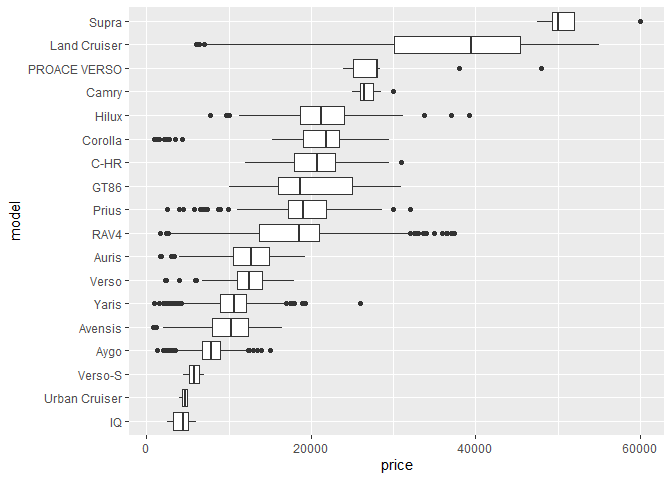
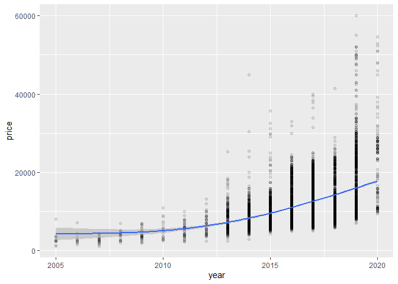

Untitled
================

``` r
library(tidyverse)
```

    ## -- Attaching packages --------------------------------------- tidyverse 1.3.1 --

    ## v ggplot2 3.3.3     v purrr   0.3.4
    ## v tibble  3.1.1     v dplyr   1.0.5
    ## v tidyr   1.1.3     v stringr 1.4.0
    ## v readr   1.4.0     v forcats 0.5.1

    ## -- Conflicts ------------------------------------------ tidyverse_conflicts() --
    ## x dplyr::filter() masks stats::filter()
    ## x dplyr::lag()    masks stats::lag()

``` r
library(GGally)
```

    ## Registered S3 method overwritten by 'GGally':
    ##   method from   
    ##   +.gg   ggplot2

``` r
library(regclass)
```

    ## Loading required package: bestglm

    ## Loading required package: leaps

    ## Loading required package: VGAM

    ## Loading required package: stats4

    ## Loading required package: splines

    ## 
    ## Attaching package: 'VGAM'

    ## The following object is masked from 'package:tidyr':
    ## 
    ##     fill

    ## Loading required package: rpart

    ## Loading required package: randomForest

    ## randomForest 4.6-14

    ## Type rfNews() to see new features/changes/bug fixes.

    ## 
    ## Attaching package: 'randomForest'

    ## The following object is masked from 'package:dplyr':
    ## 
    ##     combine

    ## The following object is masked from 'package:ggplot2':
    ## 
    ##     margin

    ## Important regclass change from 1.3:
    ## All functions that had a . in the name now have an _
    ## all.correlations -> all_correlations, cor.demo -> cor_demo, etc.

``` r
library(pROC)
```

    ## Type 'citation("pROC")' for a citation.

    ## 
    ## Attaching package: 'pROC'

    ## The following objects are masked from 'package:stats':
    ## 
    ##     cov, smooth, var

``` r
library(rsample)
library(olsrr)
```

    ## 
    ## Attaching package: 'olsrr'

    ## The following object is masked from 'package:datasets':
    ## 
    ##     rivers

``` r
setwd("C:/Users/cvill/OneDrive/Escritorio/RStudio Projects/Ayudantia 9")
toyota <- read.csv("toyota.csv")
vinos <- read.csv("winequality-red.csv")
```

``` r
toyota$model <- as.factor(toyota$model)
toyota$transmission <- as.factor(toyota$transmission)
toyota$fuelType <- as.factor(toyota$fuelType)

head(toyota)
```

    ##   model year price transmission mileage fuelType tax  mpg engineSize
    ## 1  GT86 2016 16000       Manual   24089   Petrol 265 36.2          2
    ## 2  GT86 2017 15995       Manual   18615   Petrol 145 36.2          2
    ## 3  GT86 2015 13998       Manual   27469   Petrol 265 36.2          2
    ## 4  GT86 2017 18998       Manual   14736   Petrol 150 36.2          2
    ## 5  GT86 2017 17498       Manual   36284   Petrol 145 36.2          2
    ## 6  GT86 2017 15998       Manual   26919   Petrol 260 36.2          2

``` r
toyota %>% filter(engineSize == 0) %>% nrow()
```

    ## [1] 6

``` r
toyota <- toyota %>%  filter(engineSize != 0)
toyota %>% filter(engineSize == 0) %>% nrow()
```

    ## [1] 0

``` r
toyota %>% select(year, mileage, tax, mpg, engineSize, price) %>% 
  ggpairs(lower = list(continuous = wrap("points", alpha = 0.3, size = 0.5)))
```

<!-- -->

``` r
toyota %>% 
  ggplot(aes(transmission, price)) +
  geom_boxplot()
```

<!-- -->

``` r
toyota%>% 
  ggplot(aes(fuelType, price)) +
  geom_boxplot()
```

<!-- -->

``` r
toyota %>% mutate(model = reorder(model, price)) %>%
  ggplot(aes(price, model)) +
  geom_boxplot()
```

<!-- -->

``` r
toyota %>% ggplot(aes(mileage, price)) +
  geom_point(alpha = .1) +
  stat_smooth(method = "gam", formula = y ~ s(x, k=3))
```

<!-- -->

``` r
toyota%>% ggplot(aes(year, price)) +
  geom_point(alpha = .1) +
  stat_smooth(method = "gam", formula = y ~ s(x, k=3))
```

<!-- -->

``` r
toyota %>% ggplot(aes(mpg, price)) +
  geom_point(alpha = .1) +
  stat_smooth(method = "gam", formula = y ~ s(x, k=3))
```

<!-- -->

``` r
toyota %>% ggplot(aes(engineSize, price)) +
  geom_point(alpha = .1) +
  stat_smooth(method = "gam", formula = y ~ s(x, k=3))
```

<!-- -->

``` r
toyota %>% filter(., year >= 2005) %>% ggplot(aes(year, price)) +
  geom_point(alpha = .1) +
  stat_smooth(method = "gam", formula = y ~ s(x, k=3))
```

<!-- -->

``` r
toyota_sca <- toyota
toyota_sca[,c(2,3,5,7,8,9)] <- scale(toyota_sca[,c(2,3,5,7,8,9)])
toyota_sca %>%  head()
```

    ##   model       year     price transmission     mileage fuelType       tax
    ## 1  GT86 -0.3390016 0.5476207       Manual  0.06418306   Petrol 2.3050056
    ## 2  GT86  0.1146177 0.5468329       Manual -0.22202169   Petrol 0.6808592
    ## 3  GT86 -0.7926209 0.2322067       Manual  0.24090429   Petrol 2.3050056
    ## 4  GT86  0.1146177 1.0199538       Manual -0.42483283   Petrol 0.7485320
    ## 5  GT86  0.1146177 0.7836297       Manual  0.70179118   Petrol 0.6808592
    ## 6  GT86  0.1146177 0.5473056       Manual  0.21214788   Petrol 2.2373329
    ##         mpg engineSize
    ## 1 -1.694806   1.214812
    ## 2 -1.694806   1.214812
    ## 3 -1.694806   1.214812
    ## 4 -1.694806   1.214812
    ## 5 -1.694806   1.214812
    ## 6 -1.694806   1.214812

``` r
reg_simp <- lm(price ~ mileage, data = toyota)
summary(reg_simp)
```

    ## 
    ## Call:
    ## lm(formula = price ~ mileage, data = toyota)
    ## 
    ## Residuals:
    ##    Min     1Q Median     3Q    Max 
    ## -10013  -4437  -1910   2991  46188 
    ## 
    ## Coefficients:
    ##               Estimate Std. Error t value Pr(>|t|)    
    ## (Intercept)  1.479e+04  1.151e+02  128.50   <2e-16 ***
    ## mileage     -9.901e-02  3.861e-03  -25.64   <2e-16 ***
    ## ---
    ## Signif. codes:  0 '***' 0.001 '**' 0.01 '*' 0.05 '.' 0.1 ' ' 1
    ## 
    ## Residual standard error: 6059 on 6730 degrees of freedom
    ## Multiple R-squared:  0.08901,    Adjusted R-squared:  0.08888 
    ## F-statistic: 657.6 on 1 and 6730 DF,  p-value: < 2.2e-16

``` r
reg_mult <- lm(price ~ model + year*mileage + engineSize + mpg, data = toyota_sca)
summary(reg_mult)
```

    ## 
    ## Call:
    ## lm(formula = price ~ model + year * mileage + engineSize + mpg, 
    ##     data = toyota_sca)
    ## 
    ## Residuals:
    ##      Min       1Q   Median       3Q      Max 
    ## -2.87872 -0.16417 -0.02289  0.14310  2.91021 
    ## 
    ## Coefficients:
    ##                      Estimate Std. Error t value Pr(>|t|)    
    ## (Intercept)         -0.001391   0.012592  -0.110  0.91207    
    ## model Avensis       -0.282469   0.031308  -9.022  < 2e-16 ***
    ## model Aygo          -0.327626   0.021985 -14.902  < 2e-16 ***
    ## model C-HR           0.890092   0.018572  47.927  < 2e-16 ***
    ## model Camry          0.727859   0.095175   7.648 2.34e-14 ***
    ## model Corolla        0.713442   0.023484  30.380  < 2e-16 ***
    ## model GT86           0.573701   0.040290  14.239  < 2e-16 ***
    ## model Hilux          0.426034   0.043258   9.849  < 2e-16 ***
    ## model IQ             0.110512   0.109436   1.010  0.31262    
    ## model Land Cruiser   2.503718   0.056755  44.115  < 2e-16 ***
    ## model Prius          0.703969   0.024537  28.691  < 2e-16 ***
    ## model PROACE VERSO   1.554445   0.080749  19.250  < 2e-16 ***
    ## model RAV4           0.308238   0.024964  12.347  < 2e-16 ***
    ## model Supra          3.976318   0.096118  41.369  < 2e-16 ***
    ## model Urban Cruiser -0.164767   0.152913  -1.078  0.28129    
    ## model Verso         -0.081461   0.031494  -2.587  0.00972 ** 
    ## model Verso-S        0.049601   0.176269   0.281  0.77842    
    ## model Yaris         -0.271531   0.014861 -18.271  < 2e-16 ***
    ## year                 0.253938   0.006011  42.249  < 2e-16 ***
    ## mileage             -0.226710   0.005921 -38.288  < 2e-16 ***
    ## engineSize           0.463494   0.010908  42.493  < 2e-16 ***
    ## mpg                  0.057956   0.005039  11.501  < 2e-16 ***
    ## year:mileage        -0.011753   0.002145  -5.478 4.46e-08 ***
    ## ---
    ## Signif. codes:  0 '***' 0.001 '**' 0.01 '*' 0.05 '.' 0.1 ' ' 1
    ## 
    ## Residual standard error: 0.3041 on 6709 degrees of freedom
    ## Multiple R-squared:  0.9078, Adjusted R-squared:  0.9075 
    ## F-statistic:  3004 on 22 and 6709 DF,  p-value: < 2.2e-16

``` r
VIF(reg_mult)
```

    ##                   GVIF Df GVIF^(1/(2*Df))
    ## model        17.256587 17        1.087379
    ## year          2.629541  1        1.621586
    ## mileage       2.551935  1        1.597478
    ## engineSize    8.659920  1        2.942774
    ## mpg           1.848271  1        1.359511
    ## year:mileage  1.961630  1        1.400582

``` r
fuerza_bruta <- ols_step_all_possible(reg_mult)

plot(fuerza_bruta)
```

<!-- --><!-- -->

``` r
summary(vinos)
```

    ##  fixed.acidity   volatile.acidity  citric.acid    residual.sugar  
    ##  Min.   : 4.60   Min.   :0.1200   Min.   :0.000   Min.   : 0.900  
    ##  1st Qu.: 7.10   1st Qu.:0.3900   1st Qu.:0.090   1st Qu.: 1.900  
    ##  Median : 7.90   Median :0.5200   Median :0.260   Median : 2.200  
    ##  Mean   : 8.32   Mean   :0.5278   Mean   :0.271   Mean   : 2.539  
    ##  3rd Qu.: 9.20   3rd Qu.:0.6400   3rd Qu.:0.420   3rd Qu.: 2.600  
    ##  Max.   :15.90   Max.   :1.5800   Max.   :1.000   Max.   :15.500  
    ##    chlorides       free.sulfur.dioxide total.sulfur.dioxide    density      
    ##  Min.   :0.01200   Min.   : 1.00       Min.   :  6.00       Min.   :0.9901  
    ##  1st Qu.:0.07000   1st Qu.: 7.00       1st Qu.: 22.00       1st Qu.:0.9956  
    ##  Median :0.07900   Median :14.00       Median : 38.00       Median :0.9968  
    ##  Mean   :0.08747   Mean   :15.87       Mean   : 46.47       Mean   :0.9967  
    ##  3rd Qu.:0.09000   3rd Qu.:21.00       3rd Qu.: 62.00       3rd Qu.:0.9978  
    ##  Max.   :0.61100   Max.   :72.00       Max.   :289.00       Max.   :1.0037  
    ##        pH          sulphates         alcohol         quality     
    ##  Min.   :2.740   Min.   :0.3300   Min.   : 8.40   Min.   :3.000  
    ##  1st Qu.:3.210   1st Qu.:0.5500   1st Qu.: 9.50   1st Qu.:5.000  
    ##  Median :3.310   Median :0.6200   Median :10.20   Median :6.000  
    ##  Mean   :3.311   Mean   :0.6581   Mean   :10.42   Mean   :5.636  
    ##  3rd Qu.:3.400   3rd Qu.:0.7300   3rd Qu.:11.10   3rd Qu.:6.000  
    ##  Max.   :4.010   Max.   :2.0000   Max.   :14.90   Max.   :8.000

``` r
ggplot(vinos,aes(x=factor(quality))) +
  geom_bar(col ="black",fill="#993333",alpha=0.5) +
  theme(axis.text.x = element_text(face="bold", size=10)) +
  scale_x_discrete("calidad") +
  scale_y_continuous("cantidad")
```

<!-- -->

``` r
ggplot(vinos,aes(factor(pH))) +
  geom_bar(col ="black",fill="#993333",alpha=0.5) +
  theme(axis.text.x = element_text(face="bold", size=4, angle=30)) +
  scale_y_continuous("Cantidad",limits = c(0,15),breaks=seq(0,15000,by=1500)) +
  scale_x_discrete("pH")
```

    ## Warning: Removed 40 rows containing missing values (geom_bar).

<!-- -->
