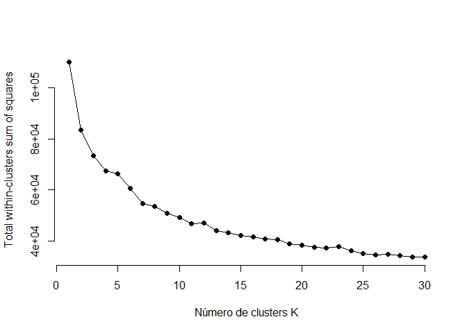
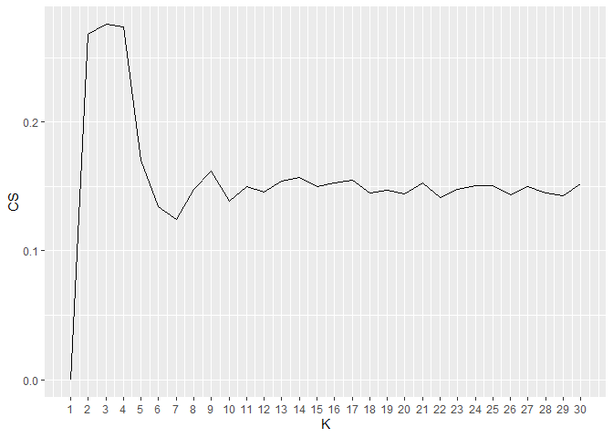
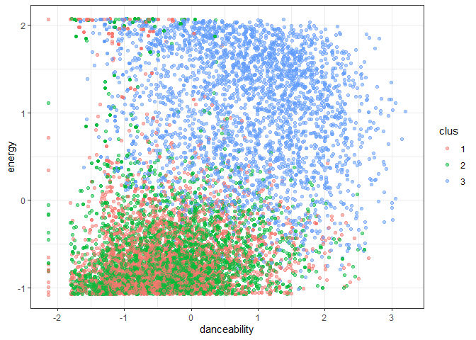
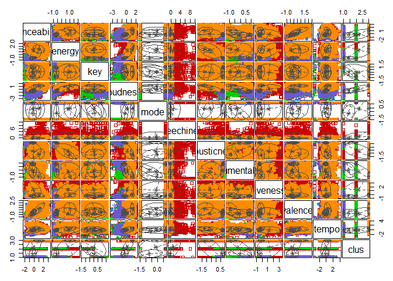

Playlist de música
================

``` r
knitr::opts_chunk$set(echo = TRUE)
```

## 1. Librerías

Se añaden las librerías para tener acceso a las funciones que permite
utilizar Rstudio

``` r
library(tidyverse)
```

    ## -- Attaching packages --------------------------------------- tidyverse 1.3.1 --

    ## v ggplot2 3.3.3     v purrr   0.3.4
    ## v tibble  3.1.1     v dplyr   1.0.5
    ## v tidyr   1.1.3     v stringr 1.4.0
    ## v readr   1.4.0     v forcats 0.5.1

    ## -- Conflicts ------------------------------------------ tidyverse_conflicts() --
    ## x dplyr::filter() masks stats::filter()
    ## x dplyr::lag()    masks stats::lag()

``` r
library(ggdendro)
library(factoextra)
```

    ## Welcome! Want to learn more? See two factoextra-related books at https://goo.gl/ve3WBa

``` r
library(cluster)
library(mclust)
```

    ## Package 'mclust' version 5.4.7
    ## Type 'citation("mclust")' for citing this R package in publications.

    ## 
    ## Attaching package: 'mclust'

    ## The following object is masked from 'package:purrr':
    ## 
    ##     map

## 2. Carga y limpieza de datos

Se carga el archivo “beats” que contiene la información necesaria de las
canciones para la creación de la playlist.

Debido al exceso de datos en el archivo “beats”, se seleccionaron las
columnas que unicamente nos servirían. Estas son: Artist\_name,
Track\_name, Track\_id, Duration\_ms y las variables representativas de
cada canción (danceability, energy, key, loudness, mode, speechiness,
acousticness, instrumentalness, liveness, valence, tempo).

Las variables de artist\_name, track\_name y track\_id son para
diferenciar las canciones una de otra, mientras que la variable
duration\_ms servirá más adelante para ponerle un límite a la duración
de la playlist.

Las variables representativas son indicadores que contienen todas las
canciones y sirven para diferenciarse unas de otras a la hora de ser
analizadas. Por ejemplo, la variable liveness mide si la canción grabada
fue realizada en un concierto o en un estudio al analizar el sonido que
la canción guarda. Si la grabación de nuestra canción no fue en un
concierto, entonces bajará la probabilidad de que en nuestra playlist
exista alguna canción realizada en vivo.

Dicho lo anterior, se procedió a eliminar los track\_id duplicados de
nuestra fuente de información y se prosiguió con eliminar los campos
vacíos y NAs que existían para evitar futuros errores de cálculo en el
análisis.

``` r
load("C:/Users/cvill/OneDrive/Escritorio/RStudio Projects/Proyecto 2 21-05/beats.RData")

beats <- select(beats, 8:18, artist_name, track_name, track_id, duration_ms)

beats <- beats[!duplicated(beats$track_id),]

beats[beats == ""] <- NA
beats <- na.omit(beats)
```

## 3. Transformación de tipo de datos

Para lograr eficazmente el análisis de la playlist, habrá que convertir
los datos. Se guardarán como double los que son numéricos e int,
mientras que se convertirán en character los que sean texto o
información no numérica.

``` r
beats$danceability <- as.double(as.character(beats$danceability))
beats$energy <- as.double(as.character(beats$energy))
beats$key <- as.double(as.character(beats$key))
beats$loudness <- as.double(as.character(beats$loudness))
beats$mode <- as.double(as.character(beats$mode))
beats$speechiness <- as.double(as.character(beats$speechiness))
beats$acousticness <- as.double(as.character(beats$acousticness))
beats$instrumentalness <- as.double(as.character(beats$instrumentalness))
beats$liveness <- as.double(as.character(beats$liveness))
beats$valence <- as.double(as.character(beats$valence))
beats$tempo <- as.double(as.character(beats$tempo))


beats$artist_name <- as.character(beats$artist_name)
beats$track_name <- as.character(beats$track_name)
beats$track_id <- as.character(beats$track_id)


beats$duration_ms <- as.double(as.character(beats$duration_ms))
```

## 4. Selección de muestra

Debido a la gran cantidad de información que se posee, se decidió hacer
un muestreo para simplificar los análisis realizados y que no tarde
demasiado en el proceso de creación de la playlist (ya que existirá
información que no será utilizada una vez que designemos los grupos y
sepamos en qué grupo está nuestra canción).

Para realizar este proceso, nos debemos asegurar que la muestra
utilizada es fiable y similar a la base beats. Es por ello que
verificaremos si se asimilan algunos datos estadísticos como su
promedio, su mediana y su desviación estandar.

``` r
set.seed(1000)
muestra <- beats[sample(nrow(beats), 10000),]
```

``` r
test_media <- select(beats, 1:10)
apply(test_media, 2, mean)
```

    ##     danceability           energy              key         loudness 
    ##       0.39066947       0.33995142       5.06142257     -18.69851501 
    ##             mode      speechiness     acousticness instrumentalness 
    ##       0.68363301       0.06896123       0.69934855       0.50728055 
    ##         liveness          valence 
    ##       0.22152894       0.33684687

``` r
test_media <- select(muestra, 1:10)
apply(test_media, 2, mean)
```

    ##     danceability           energy              key         loudness 
    ##       0.38980887       0.34207426       5.04340000     -18.67581480 
    ##             mode      speechiness     acousticness instrumentalness 
    ##       0.68650000       0.06791765       0.69491758       0.51158278 
    ##         liveness          valence 
    ##       0.22358269       0.33455767

``` r
test_mediana <- select(beats, 1:10)
apply(test_mediana, 2, median)
```

    ##     danceability           energy              key         loudness 
    ##           0.3690           0.2090           5.0000         -19.5130 
    ##             mode      speechiness     acousticness instrumentalness 
    ##           1.0000           0.0443           0.9240           0.7190 
    ##         liveness          valence 
    ##           0.1230           0.2730

``` r
test_mediana <- select(muestra, 1:10)
apply(test_mediana, 2, median)
```

    ##     danceability           energy              key         loudness 
    ##           0.3690           0.2125           5.0000         -19.4380 
    ##             mode      speechiness     acousticness instrumentalness 
    ##           1.0000           0.0443           0.9215           0.7350 
    ##         liveness          valence 
    ##           0.1220           0.2640

``` r
test_desviacion <- select(beats, 1:10)
apply(test_desviacion, 2, sd)
```

    ##     danceability           energy              key         loudness 
    ##       0.18326700       0.31758722       3.49174478       8.63546733 
    ##             mode      speechiness     acousticness instrumentalness 
    ##       0.46505850       0.09430089       0.36938176       0.41351487 
    ##         liveness          valence 
    ##       0.21915679       0.27415513

``` r
test_desviacion <- select(muestra, 1:10)
apply(test_desviacion, 2, sd)
```

    ##     danceability           energy              key         loudness 
    ##       0.18278349       0.31766997       3.50324760       8.62198215 
    ##             mode      speechiness     acousticness instrumentalness 
    ##       0.46393887       0.09007888       0.37170067       0.41451291 
    ##         liveness          valence 
    ##       0.22173434       0.27504460

Los valores son similares entre ambos con un margen de error menor al 5%
por lo que el análisis que se realizará con la muestra obtenida es de
alta fiabilidad.

## 5. Escalamiento de datos

Con el cambio de tipo de datos y la muestra ya obtenida, podemos
comenzar a escalar los datos para que todos tengan un mismo peso a la
hora de comenzar el análisis.

``` r
data_escalada <- select(muestra, 1:11)
data_escalada <- data.frame(sapply(data_escalada, scale))
```

## 6. Gráfico de codo

Como primera interacción, se decidió ver la evolución de la suma
cuadrada inter-clusters al aumentar el número de clusters para tener una
referencia aproximada de donde se comenzará el análisis y su número K.

Con el siguiente gráfico queda claro la evolución, pero para ser más
precisos se decidió también realizar analizar la evolución del
coeficiente de siluetas al aumentar los Ks para tomar la siguiente
decisión en el análisis.

``` r
SSinterior <- numeric(30)

for(k in 1:30){
  modelo <- kmeans(data_escalada, centers = k)
  SSinterior[k] <- modelo$tot.withinss
}
```

    ## Warning: did not converge in 10 iterations

``` r
plot(SSinterior, type="o", pch=19, frame=FALSE, xlab="Número de clusters K", ylab="Total within-clusters sum of squares")
```

<!-- -->

## 7. Gráfico coeficente de silueta

Como anteriormente se dijo, el coeficiente de silueta nos indica una
posición clara para comenzar a trabajar y queda representado por el
mayor valor en el gráfico. En este caso, K = 3.

Anteriormente, había realizado el mismo análisis pero con la muestra
original de la base de datos (500.000 canciones) y resultó K = 27. Este
cambio se debe al tamaño de la muestra que tomamos inicialmente y es
comprensible que tambien se reduzcan los números de clusters, por lo que
se decidió continuar con K = 3.

``` r
coefSil = numeric(30)
for(k in 2:30){
  modelo <- kmeans(data_escalada, centers = k)
  temp <- silhouette(modelo$cluster, dist(data_escalada))
  coefSil[k] <- mean(temp[,3])
}
tempDF = data.frame(CS=coefSil, K=c(1:30))

ggplot(tempDF, aes(x=K, y=CS)) + geom_line() + scale_x_continuous(breaks = c(1:30))
```

<!-- -->

## 8. Análisis gráfico de clusters en danceability / energy

Debido al bajo valor de K, el tamaño de cada clusters es distinto y las
canciones pertenecen a cada uno de ellos. Queda claro que, además, si
bien se nota una fuerte diferencia entre los clusters 2 y 3, el cluster
1 está entre ellos más que nada tomando los datos atípicos.

``` r
modelo_kmeans <- kmeans(data_escalada, centers = 3)
prueba1 <- data_escalada
prueba1$clus <- modelo_kmeans$cluster %>% as.factor()

ggplot(prueba1, aes(danceability, energy, color=clus)) + geom_point(alpha=0.5, show.legend = T) + theme_bw()
```

<!-- -->

Como se puede ver en los resultados, el cluster 1 solo tiene 263 datos,
cluster 2 tiene 3399 datos y el cluster 3 6338, siendo este el más
grande por mucha diferencia. Aquí también entraría como rol fundamental
las diferentes variables representativas que se mencionaron en el
principio del estudio. No fueron mostradas ni graficadas las otras ya
que no es necesario para el análisis, sino que sirven como ayuda visual
a la hora de decidir.

``` r
modelo_kmeans$size
```

    ## [1] 3408 3446 3146

# 9. Gráfico gaussiano multivariado

A continuación, se procederá a ver la evolución y de qué manera se están
relacionando las distintas variables representativas entre ellas, en las
que, como se puede apreciar, el color rojo es predominante en cada
escenario debido al tamaño de muestra y la distancia existente entre
datos y el centro del cluster.

Con esto, se hará una nueva prueba de clusters debido a la adaptación de
la media del cluster y el número de clusters para coincidir aún más la
muestra dentro de cada cluster.

``` r
gmm <- Mclust(prueba1)

plot(gmm, what="classification")
```

<!-- -->

El proceso completado recomendó concretar el análisis con un modelo de 7
componentes, es decir, 7 clusters. Esto llega a ser más beneficioso para
el resultado final debido a que las canciones que sean de un mismo
cluster tendrán características similares y por ende, la playlist será
un exito.

``` r
summary(gmm)
```

    ## ---------------------------------------------------- 
    ## Gaussian finite mixture model fitted by EM algorithm 
    ## ---------------------------------------------------- 
    ## 
    ## Mclust VEV (ellipsoidal, equal shape) model with 5 components: 
    ## 
    ##  log-likelihood     n  df       BIC       ICL
    ##       -96231.98 10000 410 -196240.2 -196495.8
    ## 
    ## Clustering table:
    ##    1    2    3    4    5 
    ## 1864 2157 2477 1350 2152

# 10. Canción de referencia

Como ahora haremos la playlist en base a 7 clusters, deberemos registrar
el número de cada cluster dentro de cada canción para que, al realizar
la playlist, facilite el proceso de escoger solo las que pertenezcan al
cluster de la canción referenciada.

``` r
clasificacion <- gmm$classification
rank <- cbind(muestra, clasificacion)
```

Se escogió la canción Aerodynamite de Daft Punk, la cual si se encuentra
dentro de la muestra que logramos sacar. Ahora que, se sabe que el
track\_id y el cluster al que pertenece nuestra canción, podemos crear
la playlist.

``` r
cancion <- filter(rank, artist_name=="Daft Punk", track_name=="Aerodynamite")
print(cancion$track_id)
```

    ## [1] "15WSNNQZRQDOrzuKYMyrDX"

``` r
print(cancion$clasificacion)
```

    ## [1] 2

Se crea una lista que almacene todas las canciones que pertenecen al
mismo cluster que la canción referenciada.

``` r
lista <- filter(rank, clasificacion == cancion$clasificacion)
```

A continuación, se hace el proceso de guardar en la variable playlist,
las canciones que pertenezcan a la variable lista, creada anteriormente.
Este proceso de guardado se hará una por una mientras se cumpla la
condición de que el tiempo sumado entre todas las canciones que entren a
la playlist no superen el valor de 10800000 ms o 3 hrs. Cuando se rompa
esta condición, no se guardarán más canciones en la playlist.

``` r
playlist <- NULL
playlist <- rbind.data.frame(playlist, cancion)

duracion_actual <- cancion$duration_ms
duracion_maxima <- 10800000

repeat{
  cancion2 <- lista[sample(nrow(lista),1),]
  
  if(any(playlist$track_id == cancion2$track_id)) {
    next
  }
  
  playlist <- rbind.data.frame(playlist,cancion2)
  
  duracion_actual = duracion_actual + as.numeric(cancion2$duration_ms)

  if(duracion_actual >= duracion_maxima)
    break
}
```

Para facilitar la comprensión, se imprimirá solo el nombre de la canción
y el nombre del artista que se almacenaron en la playlist.

``` r
playlist <- select(playlist,"artist_name", "track_name")
playlist
```

    ##                   artist_name
    ## 1                   Daft Punk
    ## 1957                    Queen
    ## 1403              Linkin Park
    ## 633    Mother Nature Sound FX
    ## 370      Soft Jazz Relaxation
    ## 1448   Mother Nature Sound FX
    ## 477    Mother Nature Sound FX
    ## 60           David Arkenstone
    ## 299   Wolfgang Amadeus Mozart
    ## 1039               Los Jaivas
    ## 1121                    Drake
    ## 333            Nana Mouskouri
    ## 1516                   Sum 41
    ## 1775   Mother Nature Sound FX
    ## 1183                  Genesis
    ## 513    Mother Nature Sound FX
    ## 1385   Mother Nature Sound FX
    ## 440    Mother Nature Sound FX
    ## 1250   Mother Nature Sound FX
    ## 1535   Mother Nature Sound FX
    ## 1376              David Byrne
    ## 758    Mother Nature Sound FX
    ## 1562   Mother Nature Sound FX
    ## 740    Mother Nature Sound FX
    ## 398      Soft Jazz Relaxation
    ## 1470   Mother Nature Sound FX
    ## 2143           Los Terricolas
    ## 1454   Mother Nature Sound FX
    ## 891    Mother Nature Sound FX
    ## 645    Mother Nature Sound FX
    ## 1221   Mother Nature Sound FX
    ## 1924   Mother Nature Sound FX
    ## 1159                    AC/DC
    ## 2144                    Queen
    ## 1431                 La Renga
    ## 1355   Mother Nature Sound FX
    ## 1503    Johann Sebastian Bach
    ## 1602                 Bon Jovi
    ## 1555         Armin van Buuren
    ## 1469      Easy Listening Jazz
    ## 1323 Pyotr Ilyich Tchaikovsky
    ## 244    Mother Nature Sound FX
    ## 1303   Mother Nature Sound FX
    ## 962               John Denver
    ## 2119               31 Minutos
    ## 183    Mother Nature Sound FX
    ## 596      Ludwig van Beethoven
    ## 884       Camille Saint-Saëns
    ## 268   Wolfgang Amadeus Mozart
    ## 1378     English Languagecast
    ## 1781    Johann Sebastian Bach
    ##                                                                                                                            track_name
    ## 1                                                                                                                        Aerodynamite
    ## 1957                                              Hammer To Fall - Live At Fire Fight Australia, ANZ Stadium, Sydney, Australia, 2020
    ## 1403                                                                                Plc.4 Mie Hæd (Amp Live Reanimation) [feat. Zion]
    ## 633                                                                                                                  Chirps and Waves
    ## 370                                                                                                Smoky Moment for Working from Home
    ## 1448                                                                                                                   Wintery Stream
    ## 477                                                                                                                   Natural Moments
    ## 60                                                                                                                  Taken By The Wind
    ## 299                                   Le nozze di Figaro, K.492 - Original Version, Vienna 1786 / Act 1: "Cosa stai misurando" - Live
    ## 1039                                                                                                                         El Tóten
    ## 1121                                                                                                                        Draft Day
    ## 333                                                                                                                     I Care - Live
    ## 1516                                                                                                             The Hell Song - Live
    ## 1775                                                                                                               At One With Nature
    ## 1183                                                                                   Ripples - Live From Prague,Czech Republic/2007
    ## 513                                                                                                                       Calmed Rain
    ## 1385                                                                                                                    Gentle Oceans
    ## 440                                                                                                                        Beach Rain
    ## 1250                                                                                                                          Thunder
    ## 1535                                                                                                                     Nature Music
    ## 1376                                                                                                                    Women vs. Men
    ## 758                                                                                                                   Whispering Land
    ## 1562                                                                                                                     Balcony Rain
    ## 740                                                                                                                    Fertile Aurora
    ## 398                                                                                             Incredible Vibe for Working from Home
    ## 1470                                                                                                                        Cosy Rain
    ## 2143                                                                                                                  Luto en Mi Alma
    ## 1454                                                                                                                    Divine Escape
    ## 891                                                                                                               Relaxing Sleep Rain
    ## 645                                                                                                                    Sprinkled Rain
    ## 1221                                                                                                                          Thunder
    ## 1924                                                                                                                       Ocean Rain
    ## 1159                                                                                                      Thunderstruck - Live - 1991
    ## 2144                                                                 Get Down, Make Love - Live At The Montreal Forum / November 1981
    ## 1431                                                                                                               Las Cosas que Hace
    ## 1355                                                                                                                           Rapids
    ## 1503                                                                                                Fantasia In G, BWV 572: Lentement
    ## 1602                                                                                      Any Other Day - A&E Home Video - Live Audio
    ## 1555                                                                                                              Cote d'Azur (Mixed)
    ## 1469                                                                                                 Soundtrack for Working from Home
    ## 1323                                                                                                            Trio élégiaque - Live
    ## 244                                                                                                                         One Earth
    ## 1303                                                                                                                Dangerous Insects
    ## 962                                                                                                            Whalebones and Crosses
    ## 2119                                                                                                                             Chao
    ## 183                                                                                                                   Distant Thunder
    ## 596                                                              24 Variations on "Venni Amore" in D Major, WoO 65: Thema. Allegretto
    ## 884                                                                  Samson et Dalila, Op. 47: Act 1: Scene 2: Ce Dieu que votre voix
    ## 268                                                              Ascanio in Alba, K.111 / Part 1: "Cielo! Che vidi mai?" - Recitativo
    ## 1378                                                                                                 Christmas in Italian and Spanish
    ## 1781 Wege zur Musik aus der Weihnachtsoratorium, Tiel 4 "Hirt und König, Licht und Sonne": Wundersam durcheinander arbeitende Stimmen

La duración total de la playlist es la siguiente (medida en horas).

``` r
duracion_actual/60000/60
```

    ## [1] 3.101089
