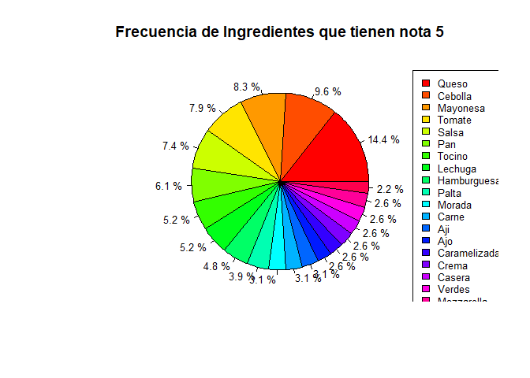
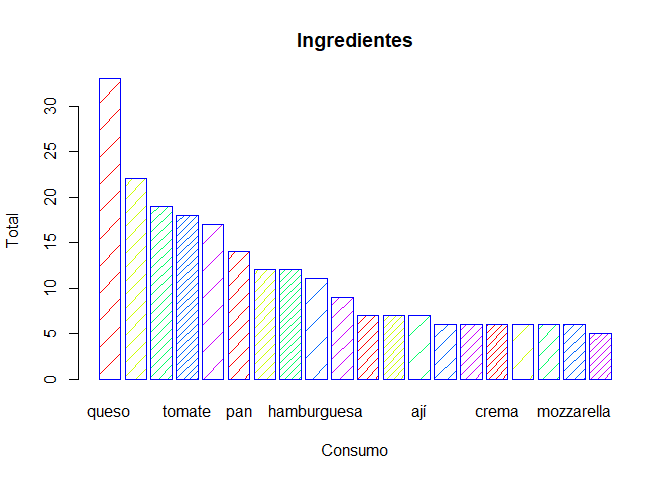

Receta de Sandwich
================

## Carga de librerías y lectura de archivo .csv

``` r
#La información del archivo es almacenada en la variable "datos"

library(quanteda)
```

    ## Package version: 2.1.2

    ## Parallel computing: 2 of 12 threads used.

    ## See https://quanteda.io for tutorials and examples.

    ## 
    ## Attaching package: 'quanteda'

    ## The following object is masked from 'package:utils':
    ## 
    ##     View

``` r
library(dplyr)
```

    ## 
    ## Attaching package: 'dplyr'

    ## The following objects are masked from 'package:stats':
    ## 
    ##     filter, lag

    ## The following objects are masked from 'package:base':
    ## 
    ##     intersect, setdiff, setequal, union

``` r
library(tidyverse)
```

    ## -- Attaching packages --------------------------------------- tidyverse 1.3.0 --

    ## v ggplot2 3.3.3     v purrr   0.3.4
    ## v tibble  3.1.0     v stringr 1.4.0
    ## v tidyr   1.1.3     v forcats 0.5.1
    ## v readr   1.4.0

    ## -- Conflicts ------------------------------------------ tidyverse_conflicts() --
    ## x dplyr::filter() masks stats::filter()
    ## x dplyr::lag()    masks stats::lag()

``` r
library(utf8)
library(ggplot2)
library(stringr)

setwd("C:/Users/cvill/OneDrive/Escritorio/RStudio Projects/Proyecto 1")
datos <- read.csv("sanguchez.csv", sep=";")

#str(datos)
#attach(datos)
#summary(datos)
```

## Limpieza de datos

``` r
# Se crea una nueva variable "data" que almacenará solo la columna "Ingredientes" de "datos" que exclusivamente tengan una nota igual a 5.

datos <- na.omit(datos)
datos <- select(datos, Ingredientes:nota)
datos <- filter(datos, nota == "5")
data <- datos$Ingredientes
#data
```

## Análisis de datos

``` r
# Se crea la variable "dfm_data" para analizar los datos de tipo "char" de la variable "data". Esto es, separar los "strings" existentes y remover las puntuaciones y conectores

dfm_data <- dfm(data, remove = stopwords("spanish"), remove_punct = TRUE)
#dfm_data
```

## Resultado del análisis

``` r
# Se crea la variable "final_data" que almacenará los 20 strings más comunes en "dfm_data" y la frecuencia obtenida por cada una de ellas 

final_data <- topfeatures(dfm_data,20)
final_data
```

    ##        queso      cebolla     mayonesa       tomate        salsa          pan 
    ##           33           22           19           18           17           14 
    ##       tocino      lechuga  hamburguesa        palta       morada        carne 
    ##           12           12           11            9            7            7 
    ##          ají          ajo caramelizada        crema       casera       verdes 
    ##            7            6            6            6            6            6 
    ##   mozzarella  champiñones 
    ##            6            5

## Grafico circular

``` r
# Se realiza un gráfico circular de los 20 ingredientes más frecuentes para conocer el porcentaje de participación de cada uno 

colores = rainbow(length(final_data))
rotulos <- round(final_data/sum(final_data)*100,1)
rotulos <- paste(rotulos,"%")

pie(final_data, main="Frecuencia de Ingredientes que tienen nota 5", col=colores, labels=rotulos, cex=0.8)


legend(1.2,1.0,cex=0.8,c("Queso","Cebolla","Mayonesa","Tomate","Salsa","Pan","Tocino","Lechuga","Hamburguesa","Palta","Morada","Carne","Aji","Ajo","Caramelizada","Crema","Casera","Verdes","Mozzarella","Champiñones"), fill=colores)
```

<!-- -->

## Gráfico de barras

``` r
# Se realiza un gráfico de barras para un resultado más visual sobre la frecuencia que tiene cada uno de los ingredientes que consiguieron una nota 5

barplot(final_data,main="Ingredientes",xlab="Consumo",ylab="Total",border="blue",col=rainbow(5),beside=TRUE,density=c(5,10,15,20))
```

<!-- --> \#\#
Conclusión final

``` r
# Una vez terminado el análisis, y tomando los 6 ingredientes más populares que obtienen 5 estrellas se llegó a la conclusión de que el queso, la cebolla, la mayonesa, el tomate, la salsa y el pan, son los que obtienen una alta probabilidad de que al lanzarse el mercado este nuevo sandwich, consiga una valoración de 5 estrellas.
```
