Untitled
================

## 0. LIBRERIAS

Se cargan las librerias que se utilizarán en este programa de análisis.

``` r
library(plyr)
library(ggplot2)
library(tidyverse)
```

    ## -- Attaching packages --------------------------------------- tidyverse 1.3.1 --

    ## v tibble  3.1.1     v dplyr   1.0.5
    ## v tidyr   1.1.3     v stringr 1.4.0
    ## v readr   1.4.0     v forcats 0.5.1
    ## v purrr   0.3.4

    ## -- Conflicts ------------------------------------------ tidyverse_conflicts() --
    ## x dplyr::arrange()   masks plyr::arrange()
    ## x purrr::compact()   masks plyr::compact()
    ## x dplyr::count()     masks plyr::count()
    ## x dplyr::failwith()  masks plyr::failwith()
    ## x dplyr::filter()    masks stats::filter()
    ## x dplyr::id()        masks plyr::id()
    ## x dplyr::lag()       masks stats::lag()
    ## x dplyr::mutate()    masks plyr::mutate()
    ## x dplyr::rename()    masks plyr::rename()
    ## x dplyr::summarise() masks plyr::summarise()
    ## x dplyr::summarize() masks plyr::summarize()

``` r
library(tidymodels)
```

    ## Registered S3 method overwritten by 'tune':
    ##   method                   from   
    ##   required_pkgs.model_spec parsnip

    ## -- Attaching packages -------------------------------------- tidymodels 0.1.3 --

    ## v broom        0.7.6      v rsample      0.1.0 
    ## v dials        0.0.9      v tune         0.1.5 
    ## v infer        0.5.4      v workflows    0.2.2 
    ## v modeldata    0.1.0      v workflowsets 0.0.2 
    ## v parsnip      0.1.6      v yardstick    0.0.8 
    ## v recipes      0.1.16

    ## -- Conflicts ----------------------------------------- tidymodels_conflicts() --
    ## x dplyr::arrange()   masks plyr::arrange()
    ## x purrr::compact()   masks plyr::compact()
    ## x dplyr::count()     masks plyr::count()
    ## x scales::discard()  masks purrr::discard()
    ## x dplyr::failwith()  masks plyr::failwith()
    ## x dplyr::filter()    masks stats::filter()
    ## x recipes::fixed()   masks stringr::fixed()
    ## x dplyr::id()        masks plyr::id()
    ## x dplyr::lag()       masks stats::lag()
    ## x dplyr::mutate()    masks plyr::mutate()
    ## x dplyr::rename()    masks plyr::rename()
    ## x yardstick::spec()  masks readr::spec()
    ## x recipes::step()    masks stats::step()
    ## x dplyr::summarise() masks plyr::summarise()
    ## x dplyr::summarize() masks plyr::summarize()
    ## * Use tidymodels_prefer() to resolve common conflicts.

``` r
library(discrim)
```

    ## 
    ## Attaching package: 'discrim'

    ## The following object is masked from 'package:dials':
    ## 
    ##     smoothness

``` r
library(caret)
```

    ## Loading required package: lattice

    ## 
    ## Attaching package: 'caret'

    ## The following objects are masked from 'package:yardstick':
    ## 
    ##     precision, recall, sensitivity, specificity

    ## The following object is masked from 'package:purrr':
    ## 
    ##     lift

``` r
library(pROC)
```

    ## Type 'citation("pROC")' for a citation.

    ## 
    ## Attaching package: 'pROC'

    ## The following objects are masked from 'package:stats':
    ## 
    ##     cov, smooth, var

``` r
library(naivebayes)
```

    ## naivebayes 0.9.7 loaded

``` r
library(kknn)
```

    ## 
    ## Attaching package: 'kknn'

    ## The following object is masked from 'package:caret':
    ## 
    ##     contr.dummy

``` r
library(rpart)
```

    ## 
    ## Attaching package: 'rpart'

    ## The following object is masked from 'package:dials':
    ## 
    ##     prune

``` r
library(rpart.plot)
library(regclass)
```

    ## Loading required package: bestglm

    ## Loading required package: leaps

    ## Loading required package: VGAM

    ## Loading required package: stats4

    ## Loading required package: splines

    ## 
    ## Attaching package: 'VGAM'

    ## The following object is masked from 'package:caret':
    ## 
    ##     predictors

    ## The following object is masked from 'package:workflows':
    ## 
    ##     update_formula

    ## The following object is masked from 'package:tidyr':
    ## 
    ##     fill

    ## Loading required package: randomForest

    ## randomForest 4.6-14

    ## Type rfNews() to see new features/changes/bug fixes.

    ## 
    ## Attaching package: 'randomForest'

    ## The following object is masked from 'package:dplyr':
    ## 
    ##     combine

    ## The following object is masked from 'package:ggplot2':
    ## 
    ##     margin

    ## Important regclass change from 1.3:
    ## All functions that had a . in the name now have an _
    ## all.correlations -> all_correlations, cor.demo -> cor_demo, etc.

    ## 
    ## Attaching package: 'regclass'

    ## The following object is masked from 'package:lattice':
    ## 
    ##     qq

## 1. BASE DE DATOS

Se carga la base de datos “endurance.rds” de HumanPower y se hace un
summary para hacer una visualización general de los datos y sus tipos de
variables.

``` r
endurance <- readRDS("C:/Users/cvill/OneDrive/Escritorio/RStudio Projects/Proyecto 3/endurance.rds")

summary(endurance)
```

    ##        id             type              athlete            calories       
    ##  Min.   :     1   Length:167615      Min.   : 8558143   Min.   :     0.0  
    ##  1st Qu.: 41905   Class :character   1st Qu.:14204866   1st Qu.:   281.0  
    ##  Median : 83808   Mode  :character   Median :15621719   Median :   629.0  
    ##  Mean   : 83808                      Mean   :15359426   Mean   :   816.7  
    ##  3rd Qu.:125712                      3rd Qu.:16685446   3rd Qu.:  1076.8  
    ##  Max.   :167615                      Max.   :18078075   Max.   :326157.3  
    ##     distance         elev_low           records           elev_high        
    ##  Min.   :      0   Length:167615      Length:167615      Length:167615     
    ##  1st Qu.:   6159   Class :character   Class :character   Class :character  
    ##  Median :  12968   Mode  :character   Mode  :character   Mode  :character  
    ##  Mean   :  21998                                                           
    ##  3rd Qu.:  27494                                                           
    ##  Max.   :1479320                                                           
    ##   max_speed         device_name         moving_time        elapsed_time      
    ##  Length:167615      Length:167615      Min.   :       0   Min.   :        0  
    ##  Class :character   Class :character   1st Qu.:    2248   1st Qu.:     2582  
    ##  Mode  :character   Mode  :character   Median :    3853   Median :     4450  
    ##                                        Mean   :    5141   Mean   :    32102  
    ##                                        3rd Qu.:    6516   3rd Qu.:     7934  
    ##                                        Max.   :11025474   Max.   :511111044  
    ##  average_speed      has_heartrate      start_date_local             
    ##  Length:167615      Length:167615      Min.   :1999-04-25 17:36:38  
    ##  Class :character   Class :character   1st Qu.:2016-11-23 17:11:10  
    ##  Mode  :character   Mode  :character   Median :2019-01-26 13:37:56  
    ##                                        Mean   :2018-05-12 07:50:32  
    ##                                        3rd Qu.:2020-04-30 04:33:10  
    ##                                        Max.   :2021-02-02 11:37:09  
    ##  total_elevation_gain
    ##  Min.   :    0.0     
    ##  1st Qu.:   15.1     
    ##  Median :  171.0     
    ##  Mean   :  397.0     
    ##  3rd Qu.:  595.0     
    ##  Max.   :59595.0

Podemos identificar que la variable “type” contiene la categoría de
deporte existentes dentro de la aplicación HumanPower. Esto será de
vital importancia a la hora de evaluar las características que registran
los datos cada usuario. Con esto, podremos identificar cuáles estarán
mal catalogados dentro de la base de datos.

``` r
unique(endurance$type)
```

    ## [1] "Ride"      "Run"       "Walk"      "Hike"      "EBikeRide"

## 2. TRANSFORMACIÓN DE VARIABLES

Se hace una transformación de variables de formato char a formato num.
Esto facilitará el análisis posterior que realizaremos con la
visualización de las variables dentro de gráficos.

Debido a que se nos solicita identificar a los posibles registros
erroneos del dispositivo, separaremos la variable “Type” en un caso
binario. Si está identificada como “Walk” “Run o”Hike" se te
representará con el valor 1. Si se identifica como “Bike” o “EBikeRide”
se representará como 0. Esto para facilitar el análisis en los modelos
binarios.

``` r
endurance$elev_low <- as.numeric(endurance$elev_low)
endurance$elev_high <- as.numeric(endurance$elev_high)
endurance$max_speed <- as.numeric(endurance$max_speed)
endurance$average_speed <- as.numeric(endurance$average_speed)

endurance$has_heartrate <- (endurance$has_heartrate == "TRUE") %>% as.numeric()

endurance$deporte <- (endurance$type == "Walk" | 
                        endurance$type == "Run" | 
                        endurance$type == "Hike") %>% as.numeric()
endurance$deporte <- as.factor(endurance$deporte)

endurance <- na.omit(endurance)
glimpse(endurance)
```

    ## Rows: 151,990
    ## Columns: 17
    ## $ id                   <int> 1, 2, 3, 4, 5, 6, 7, 8, 9, 10, 11, 12, 13, 14, 15~
    ## $ type                 <chr> "Ride", "Ride", "Ride", "Ride", "Ride", "Ride", "~
    ## $ athlete              <dbl> 13279977, 13279977, 13279977, 13279977, 13279977,~
    ## $ calories             <dbl> 520.9, 538.0, 741.6, 314.5, 696.5, 109.1, 510.9, ~
    ## $ distance             <dbl> 13130.5, 12938.7, 17515.7, 7931.4, 17072.7, 3195.~
    ## $ elev_low             <dbl> 337.3, 338.5, 301.6, 339.2, 336.2, 333.6, 336.1, ~
    ## $ records              <chr> "0", "1", "0", "0", "1", "0", "0", "1", "1", "0",~
    ## $ elev_high            <dbl> 375.6, 477.0, 377.0, 389.7, 389.4, 369.1, 379.9, ~
    ## $ max_speed            <dbl> 10.5, 11.4, 11.6, 10.2, 14.2, 6.8, 11.5, 9.9, 15.~
    ## $ device_name          <chr> "Strava iPhone App", "Strava iPhone App", "Strava~
    ## $ moving_time          <dbl> 3908, 3791, 3837, 2280, 4188, 1237, 2873, 2439, 5~
    ## $ elapsed_time         <dbl> 4326, 4975, 4510, 2521, 4473, 4166, 3390, 2759, 5~
    ## $ average_speed        <dbl> 3.360, 3.413, 4.565, 3.479, 4.077, 2.583, 4.363, ~
    ## $ has_heartrate        <dbl> 0, 0, 0, 0, 0, 0, 0, 0, 0, 0, 0, 0, 0, 0, 0, 0, 0~
    ## $ start_date_local     <dttm> 2015-10-25 07:33:45, 2015-10-23 06:44:01, 2015-1~
    ## $ total_elevation_gain <dbl> 206.0, 287.9, 309.1, 156.4, 268.8, 36.3, 192.6, 1~
    ## $ deporte              <fct> 0, 0, 0, 0, 0, 0, 0, 0, 0, 0, 0, 0, 0, 0, 0, 0, 0~

## 3. LIMPIEZA DE DATOS

Se visualizarán como están distribuidos los datos para encontrar cuáles
son los datos atípicos en las variables numéricas y eliminar a los que
fueron registrados erroneamente. Para los datos atípicos que puedan ser
verídicos, se conservarán en el modelo.

``` r
attach(endurance)
boxplot(calories, horizontal = TRUE)
```

<!-- -->

``` r
#boxplot.stats(calories)
boxplot(distance, horizontal = TRUE)
```

<!-- -->

``` r
#boxplot.stats(distance)
boxplot(average_speed, horizontal = TRUE)
```

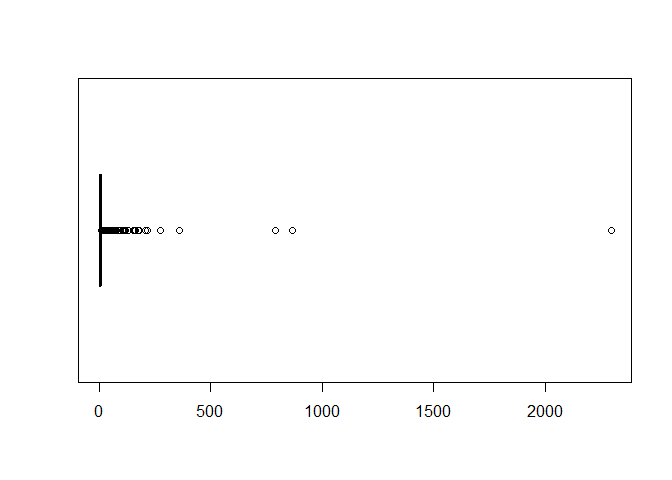<!-- -->

``` r
#boxplot.stats(average_speed)
boxplot(max_speed, horizontal = TRUE)
```

<!-- -->

``` r
#boxplot.stats(max_speed)
boxplot(moving_time, horizontal = TRUE)
```

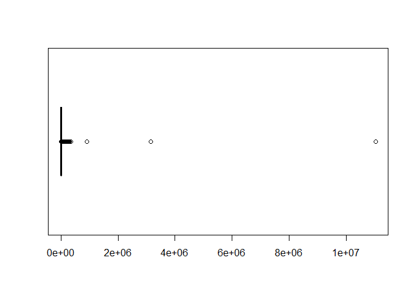<!-- -->

``` r
#boxplot.stats(moving_time)
boxplot(elev_low, horizontal = TRUE)
```

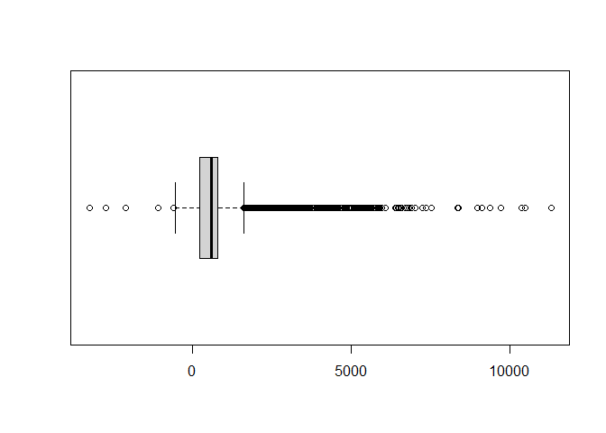<!-- -->

``` r
#boxplot.stats(elev_low)
boxplot(elev_high, horizontal = TRUE)
```

<!-- -->

``` r
#boxplot.stats(elev_high)
boxplot(total_elevation_gain, horizontal = TRUE)
```

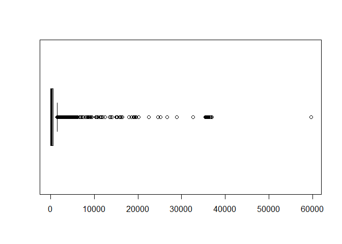<!-- -->

``` r
#boxplot.stats(total_elevation_gain)
```

Como podemos observar en las cajas de bigotes, existe una gran cantidad
de datos atípicos debido a la enorme base de datos (+150k obs.). Es por
esto que, tras 9 iteraciones con restricciones en las variables
numéricas, se alcanzó un punto donde los datos presentes casi hay
inexistentes datos atípicos erroneos, pues la mayoría son verídicos. (Un
ciclista profesional va a una velocidad máxima de 60 km/hr, y en una
sesión de entrenamiento intensa no se queman más de 2000 calorías). La
distribución de los datos después de la limpieza quedó de la siguiente
forma.

``` r
attach(endurance)
```

    ## The following objects are masked from endurance (pos = 3):
    ## 
    ##     athlete, average_speed, calories, deporte, device_name, distance,
    ##     elapsed_time, elev_high, elev_low, has_heartrate, id, max_speed,
    ##     moving_time, records, start_date_local, total_elevation_gain, type

``` r
endurance <- filter(endurance, calories > 0 & distance > 0 & average_speed > 0 & max_speed > 0 & moving_time > 0 & elev_low > -1000 & elev_high > 0 & total_elevation_gain > 0)
endurance <- filter(endurance, calories < 2000 & distance< 50000 & average_speed < 40 & max_speed < 60 & moving_time < 20000 & elev_low < 5000 & elev_high < 6000 & total_elevation_gain < 3500)
attach(endurance)
```

    ## The following objects are masked from endurance (pos = 3):
    ## 
    ##     athlete, average_speed, calories, deporte, device_name, distance,
    ##     elapsed_time, elev_high, elev_low, has_heartrate, id, max_speed,
    ##     moving_time, records, start_date_local, total_elevation_gain, type

    ## The following objects are masked from endurance (pos = 4):
    ## 
    ##     athlete, average_speed, calories, deporte, device_name, distance,
    ##     elapsed_time, elev_high, elev_low, has_heartrate, id, max_speed,
    ##     moving_time, records, start_date_local, total_elevation_gain, type

``` r
boxplot(calories, horizontal = TRUE)
```

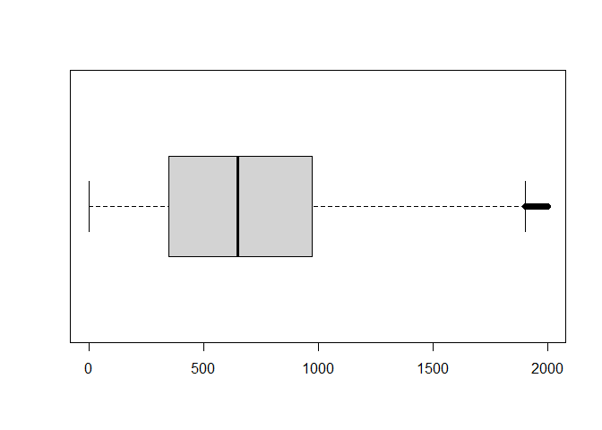<!-- -->

``` r
#boxplot.stats(calories)
boxplot(distance, horizontal = TRUE)
```

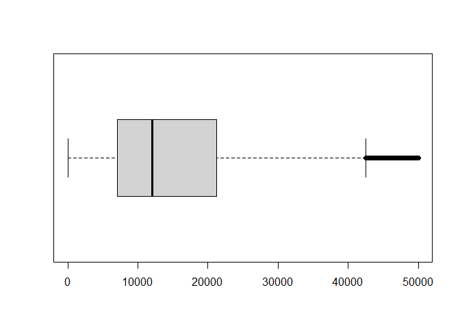<!-- -->

``` r
#boxplot.stats(distance)
boxplot(average_speed, horizontal = TRUE)
```

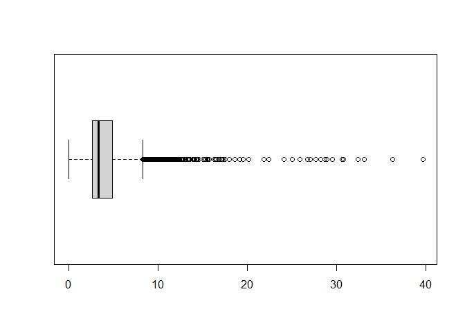<!-- -->

``` r
#boxplot.stats(average_speed)
boxplot(max_speed, horizontal = TRUE)
```

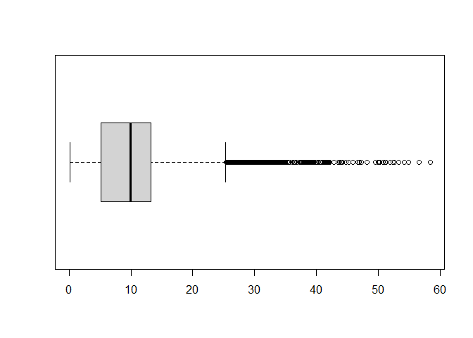<!-- -->

``` r
#boxplot.stats(max_speed)
boxplot(moving_time, horizontal = TRUE)
```

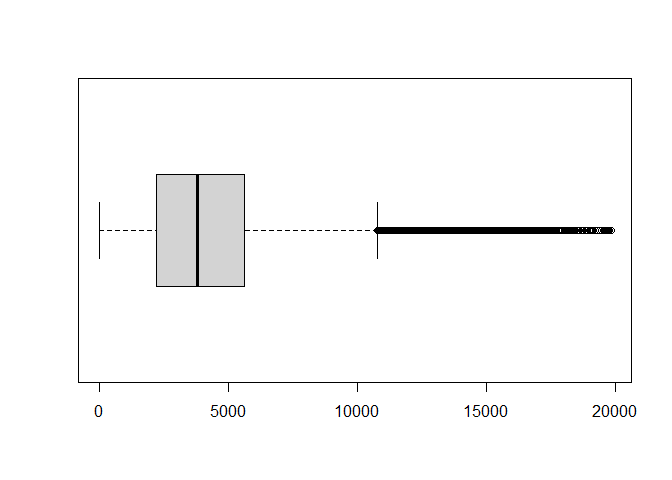<!-- -->

``` r
#boxplot.stats(moving_time)
boxplot(elev_low, horizontal = TRUE)
```

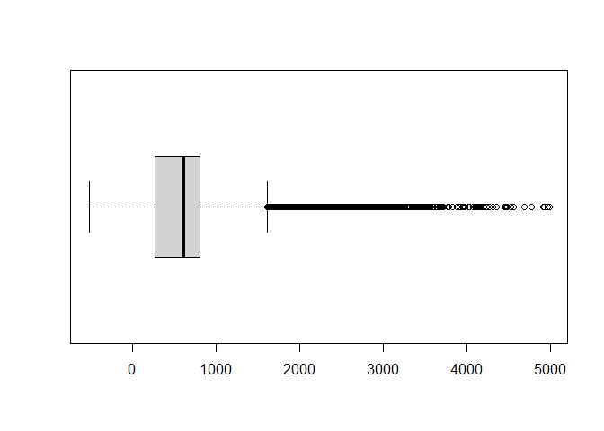<!-- -->

``` r
#boxplot.stats(elev_low)
boxplot(elev_high, horizontal = TRUE)
```

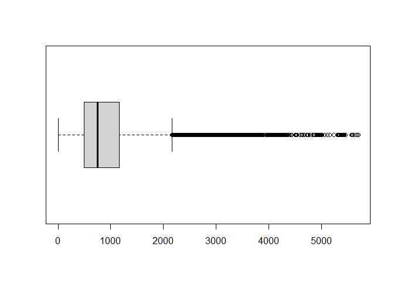<!-- -->

``` r
#boxplot.stats(elev_high)
boxplot(total_elevation_gain, horizontal = TRUE)
```

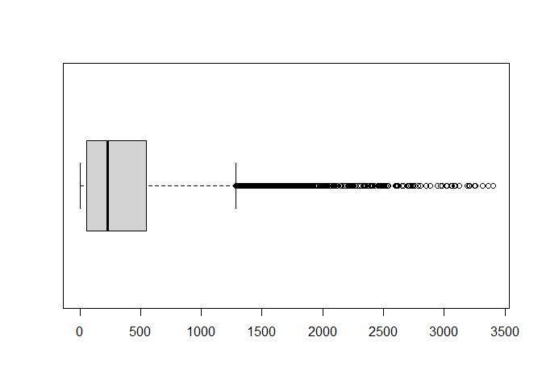<!-- -->

``` r
#boxplot.stats(total_elevation_gain)
```

## 4. ATRIBUTOS Y VARIABLES

Para comenzar con el proceso de modelamiento de datos, se tomarán las
variables numéricas más importantes en el análisis. En este transcurso,
se eliminarán variables char y variables numéricas no relevantes en el
modelo.

Las seleccionadas son: “Deporte” - “Calories” - “Distance” -
“Moving\_time” - “elapsed\_time” - “average\_speed” - “max\_speed” -
“elev\_low” - “elev\_high” - “total\_elevation\_gain”.

A excepción de la variable “Deporte” que es factor, las demás actúan
como numéricas.

``` r
atributos <- select(endurance,"deporte","calories","distance","moving_time","elapsed_time","average_speed","max_speed","elev_low","elev_high","total_elevation_gain")

glimpse(atributos)
```

    ## Rows: 106,874
    ## Columns: 10
    ## $ deporte              <fct> 0, 0, 0, 0, 0, 0, 0, 0, 0, 0, 0, 0, 0, 0, 0, 0, 0~
    ## $ calories             <dbl> 520.9, 538.0, 741.6, 314.5, 696.5, 109.1, 510.9, ~
    ## $ distance             <dbl> 13130.5, 12938.7, 17515.7, 7931.4, 17072.7, 3195.~
    ## $ moving_time          <dbl> 3908, 3791, 3837, 2280, 4188, 1237, 2873, 2439, 5~
    ## $ elapsed_time         <dbl> 4326, 4975, 4510, 2521, 4473, 4166, 3390, 2759, 5~
    ## $ average_speed        <dbl> 3.360, 3.413, 4.565, 3.479, 4.077, 2.583, 4.363, ~
    ## $ max_speed            <dbl> 10.5, 11.4, 11.6, 10.2, 14.2, 6.8, 11.5, 9.9, 15.~
    ## $ elev_low             <dbl> 337.3, 338.5, 301.6, 339.2, 336.2, 333.6, 336.1, ~
    ## $ elev_high            <dbl> 375.6, 477.0, 377.0, 389.7, 389.4, 369.1, 379.9, ~
    ## $ total_elevation_gain <dbl> 206.0, 287.9, 309.1, 156.4, 268.8, 36.3, 192.6, 1~

Se inicia el muestreo de la data, tomando el 75% de los datos para el
ejercicio y 25% para un testeo de modelos. También se crean subsets para
ayudar en los modelos que se ocuparán para el análisis.

``` r
data_split <- initial_split(atributos, prop = 3/4)

train_data <- training(data_split) 
test_data <- testing(data_split)

train <- subset(train_data)
test <- subset(test_data)
```

## 5. REGRESIÓN MULTIPLE

A continuación se hará la regresión multiple de las variables para
identificar las variables estadisticamente significativas.

``` r
regresion_multiple <- lm(deporte %>% as.numeric() ~ calories+distance+moving_time+elapsed_time+average_speed+max_speed+elev_low+elev_high+total_elevation_gain, data = atributos)
summary(regresion_multiple)
```

    ## 
    ## Call:
    ## lm(formula = deporte %>% as.numeric() ~ calories + distance + 
    ##     moving_time + elapsed_time + average_speed + max_speed + 
    ##     elev_low + elev_high + total_elevation_gain, data = atributos)
    ## 
    ## Residuals:
    ##     Min      1Q  Median      3Q     Max 
    ## -1.8988 -0.2094  0.0258  0.1981  5.1877 
    ## 
    ## Coefficients:
    ##                        Estimate Std. Error  t value Pr(>|t|)    
    ## (Intercept)           2.098e+00  4.328e-03  484.773  < 2e-16 ***
    ## calories              4.587e-04  3.434e-06  133.572  < 2e-16 ***
    ## distance             -2.911e-06  2.096e-07  -13.888  < 2e-16 ***
    ## moving_time          -2.105e-05  9.398e-07  -22.399  < 2e-16 ***
    ## elapsed_time          3.824e-10  4.102e-10    0.932    0.351    
    ## average_speed        -6.542e-02  9.497e-04  -68.885  < 2e-16 ***
    ## max_speed            -5.296e-02  2.710e-04 -195.415  < 2e-16 ***
    ## elev_low             -3.512e-05  6.022e-06   -5.831 5.51e-09 ***
    ## elev_high             2.437e-05  5.057e-06    4.819 1.44e-06 ***
    ## total_elevation_gain -3.598e-04  5.483e-06  -65.618  < 2e-16 ***
    ## ---
    ## Signif. codes:  0 '***' 0.001 '**' 0.01 '*' 0.05 '.' 0.1 ' ' 1
    ## 
    ## Residual standard error: 0.2917 on 106864 degrees of freedom
    ## Multiple R-squared:  0.6454, Adjusted R-squared:  0.6453 
    ## F-statistic: 2.161e+04 on 9 and 106864 DF,  p-value: < 2.2e-16

Los resultados entregados por la regresión multiple da un coef. det.
64.5% y demuestra que hay variables presentes no tan significativas en
el modelo.

Estas son: Elapsed\_time - elev\_low - elev\_high

## 6. MODELO ARBOL DE DECISIÓN

Creamos la receta del modelo.

``` r
receta <- recipe(deporte ~ ., data = train)
receta
```

    ## Data Recipe
    ## 
    ## Inputs:
    ## 
    ##       role #variables
    ##    outcome          1
    ##  predictor          9

Se ocuparan 5 capas de decisión y un mínimo de 10 entidades por hoja.

``` r
modelo_trees <-
  decision_tree(tree_depth = 5, min_n = 10) %>% 
  set_engine("rpart") %>% 
  set_mode("classification")

modelo_trees
```

    ## Decision Tree Model Specification (classification)
    ## 
    ## Main Arguments:
    ##   tree_depth = 5
    ##   min_n = 10
    ## 
    ## Computational engine: rpart

Con el fit del modelo se calcularán las predicciones y el AUC.

``` r
fit_mod <- function(mod){
  
  modelo_fit <- 
  workflow() %>% 
  add_model(mod) %>% 
  add_recipe(receta) %>% 
  fit(data = train)

model_pred <- 
  predict(modelo_fit, test, type = "prob") %>% 
  bind_cols(test) 

return(model_pred %>% 
  roc_auc(truth = deporte, .pred_0))
}

fit_mod(modelo_trees)
```

    ## # A tibble: 1 x 3
    ##   .metric .estimator .estimate
    ##   <chr>   <chr>          <dbl>
    ## 1 roc_auc binary         0.960

El AUC resultante del modelo es de 96,12%, un resultado que pertenece al
intervalo \[0.9 , 0.97\], siendo considerado un test muy bueno.

Con este valor ya podremos analizar la data, pero buscaremos un valor de
AUC &gt; 0.97 para tener una mayor confianza en los resultados.

## 6. MODELO REGRESIÓN LOGÍSTICA

``` r
modelo_rl <- 
  logistic_reg() %>% 
  set_engine("glm")

fit_mod(modelo_rl)
```

    ## Warning: glm.fit: fitted probabilities numerically 0 or 1 occurred

    ## # A tibble: 1 x 3
    ##   .metric .estimator .estimate
    ##   <chr>   <chr>          <dbl>
    ## 1 roc_auc binary         0.979

El AUC resultante es de 98.07%, un muy buen valor y que cumple nuestras
expectativas de análisis. Continuaremos con el siguiente modelo para
comparar valores de AUC.

## 8. MODELO NAIVE BAYES

``` r
modelo_nb <-
  naive_Bayes(smoothness = .8) %>%
  set_engine("naivebayes")

fit_mod(modelo_nb)
```

    ## # A tibble: 1 x 3
    ##   .metric .estimator .estimate
    ##   <chr>   <chr>          <dbl>
    ## 1 roc_auc binary         0.977

El AUC resultante es de 97.8%.

## 9. MODELO KNN

``` r
modelo_knn <-
  nearest_neighbor(neighbors = 5) %>% 
  set_engine("kknn") %>% 
  set_mode("classification")

fit_mod(modelo_knn)
```

    ## # A tibble: 1 x 3
    ##   .metric .estimator .estimate
    ##   <chr>   <chr>          <dbl>
    ## 1 roc_auc binary         0.991

El AUC resultante es de 99.01%. El mejor obtenido hasta ahora.

A continuación veremos la ramificación de los datos.

``` r
categorias <- rpart(deporte~., data = train, method = "class")

rpart.plot(categorias)
```

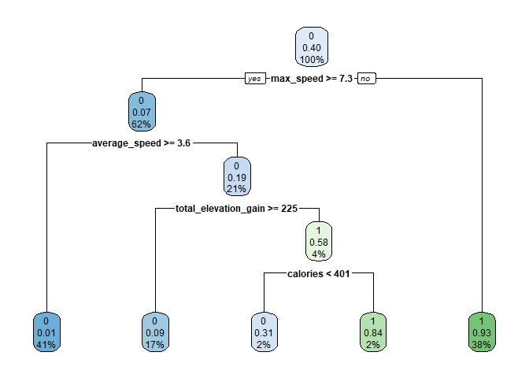<!-- -->

## 9. PREDICCIÓN DE MODELO

``` r
pred_deporte <- predict(categorias, newdata = test, type = "class")
pred_deporte %>% as.data.frame() %>% head()
```

    ##    .
    ## 1  1
    ## 2  0
    ## 5  0
    ## 9  0
    ## 23 1
    ## 27 0

``` r
pred_deporte %>% as.data.frame() %>% tail()
```

    ##        .
    ## 106840 1
    ## 106846 1
    ## 106851 0
    ## 106856 0
    ## 106865 1
    ## 106869 0

``` r
test_data$pred_deporte <- pred_deporte
```

## 10. PREDICCIÓN DE LA CURVA AUC

``` r
pred_incom_roc <- predict(categorias, newdata = test, type = "prob")
pred_incom_roc %>% as.data.frame() %>% head()
```

    ##             0          1
    ## 1  0.16176471 0.83823529
    ## 2  0.90619508 0.09380492
    ## 5  0.98563297 0.01436703
    ## 9  0.98563297 0.01436703
    ## 23 0.06558942 0.93441058
    ## 27 0.98563297 0.01436703

``` r
pred_incom_roc %>% as.data.frame() %>% tail()
```

    ##                 0          1
    ## 106840 0.06558942 0.93441058
    ## 106846 0.06558942 0.93441058
    ## 106851 0.98563297 0.01436703
    ## 106856 0.98563297 0.01436703
    ## 106865 0.06558942 0.93441058
    ## 106869 0.90619508 0.09380492

``` r
pred_incom_roc <- pred_incom_roc %>% as.data.frame()
prob <- pred_incom_roc$"1"
```

## 11. EVALUACIÓN DEL MODELO

``` r
cm <- confusionMatrix(table(test_data$deporte, test_data$pred_deporte))
test_data$pred_deporte <- as.factor(test_data$pred_deporte)

table <- data.frame(confusionMatrix(test_data$deporte, test_data$pred_deporte)$table)

print(cm)
```

    ## Confusion Matrix and Statistics
    ## 
    ##    
    ##         0     1
    ##   0 15297   776
    ##   1   759  9887
    ##                                           
    ##                Accuracy : 0.9426          
    ##                  95% CI : (0.9397, 0.9453)
    ##     No Information Rate : 0.6009          
    ##     P-Value [Acc > NIR] : <2e-16          
    ##                                           
    ##                   Kappa : 0.8802          
    ##                                           
    ##  Mcnemar's Test P-Value : 0.683           
    ##                                           
    ##             Sensitivity : 0.9527          
    ##             Specificity : 0.9272          
    ##          Pos Pred Value : 0.9517          
    ##          Neg Pred Value : 0.9287          
    ##              Prevalence : 0.6009          
    ##          Detection Rate : 0.5725          
    ##    Detection Prevalence : 0.6016          
    ##       Balanced Accuracy : 0.9400          
    ##                                           
    ##        'Positive' Class : 0               
    ## 

``` r
print(cm$byClass)
```

    ##          Sensitivity          Specificity       Pos Pred Value 
    ##            0.9527280            0.9272250            0.9517203 
    ##       Neg Pred Value            Precision               Recall 
    ##            0.9287056            0.9517203            0.9527280 
    ##                   F1           Prevalence       Detection Rate 
    ##            0.9522238            0.6009207            0.5725139 
    ## Detection Prevalence    Balanced Accuracy 
    ##            0.6015569            0.9399765

``` r
plotTable <- table %>%
  mutate(goodbad = ifelse(table$Prediction == table$Reference, "Good", "Bad")) %>%
  group_by(Reference) %>%
  mutate(prop = Freq/sum(Freq))

confusionMatrix <- ggplot(data = plotTable, mapping = aes(x = Reference, y = Prediction, fill = goodbad, alpha = prop)) +
  geom_tile() +
  geom_text(aes(label = Freq), vjust = .5, fontface  = "bold", alpha = 25, size = 8) +
  scale_fill_manual(name = " ", values = c(Good = "#F0FF00", Bad = "#34495E")) +
  scale_alpha(name = " ") +
  theme_classic() +
  xlim(rev(levels(table$Reference))) +
  scale_y_discrete(name = "Predicted", limits = c("1","0")) + 
  scale_x_discrete(name = "Actual", position = "top") +
  #theme(legend.position = " ") +
  theme(text=element_text(size=25,  family="sans")) + 
  ggtitle("Confusion Matrix") +
  theme(plot.title = element_text(size = 25, family="sans", face = "bold"))
```

    ## Scale for 'x' is already present. Adding another scale for 'x', which will
    ## replace the existing scale.

``` r
confusionMatrix
```

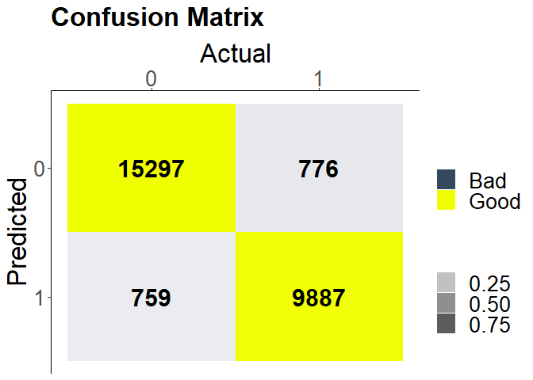<!-- -->

## 12. GRÁFICA DE LA CURVA AUC

``` r
ROC <- roc(test_data$deporte,prob)
```

    ## Setting levels: control = 0, case = 1

    ## Setting direction: controls < cases

``` r
plot(ROC, col = "#fd634b", family = "sans", cex = 2, main = "CART Model ROC Curve 
AUC = 0.8474")
```

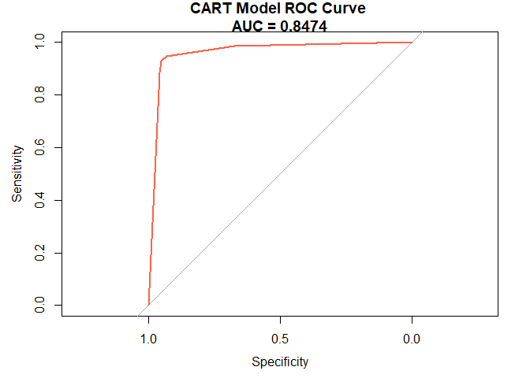<!-- -->

``` r
auc(ROC)
```

    ## Area under the curve: 0.9605

## 13. MODELO KNN - RESULTADOS

Fue el AUC más alto que se pudo conseguir por lo que se utilizará para
calcular los resultados.

``` r
Final <- 
  workflow() %>% 
  add_model(modelo_knn) %>% 
  add_recipe(receta) %>% 
  fit(data = train)
Final2 <- 
  predict(Final, test, type = "prob") %>% 
  bind_cols(test)
```

``` r
test$prediccion <- ifelse(Final2$.pred_0 >= Final2$.pred_1, 0,1)
```

## 14. ERRORES TOTALES

``` r
Errores <- test %>% filter(deporte != prediccion)
nrow(Errores)
```

    ## [1] 664

En total, existen 651 errores en la base de datos según el modelo knn.
