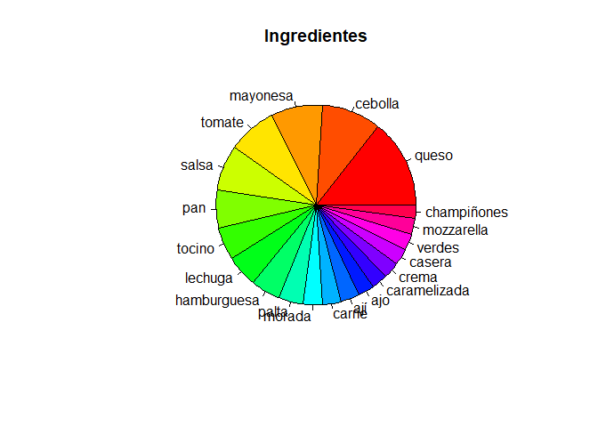

Untitled
================

## Se cargan las librerias que se utilizarán en el programa y se lee el archivo excel almacenando la información en la variable “datos”

``` r
library(quanteda)
```

    ## Package version: 2.1.2

    ## Parallel computing: 2 of 12 threads used.

    ## See https://quanteda.io for tutorials and examples.

    ## 
    ## Attaching package: 'quanteda'

    ## The following object is masked from 'package:utils':
    ## 
    ##     View

``` r
library(dplyr)
```

    ## 
    ## Attaching package: 'dplyr'

    ## The following objects are masked from 'package:stats':
    ## 
    ##     filter, lag

    ## The following objects are masked from 'package:base':
    ## 
    ##     intersect, setdiff, setequal, union

``` r
library(tidyverse)
```

    ## -- Attaching packages --------------------------------------- tidyverse 1.3.0 --

    ## v ggplot2 3.3.3     v purrr   0.3.4
    ## v tibble  3.1.0     v stringr 1.4.0
    ## v tidyr   1.1.3     v forcats 0.5.1
    ## v readr   1.4.0

    ## -- Conflicts ------------------------------------------ tidyverse_conflicts() --
    ## x dplyr::filter() masks stats::filter()
    ## x dplyr::lag()    masks stats::lag()

``` r
library(utf8)
library(ggplot2)
library(stringr)

setwd("C:/Users/cvill/OneDrive/Escritorio/RStudio Projects")
datos <- read.csv("sanguchez.csv", sep=";")

#str(datos)
#attach(datos)
#summary(datos)
```

## Con la variable “datos” se eliminan las filas que tengan un valor N.A. en alguna de sus columnas. A continuación se seleccionan las columnas “Ingredientes” y “nota” para trabajar con ellas y filtrando la información si cumplen la condición de tener en “nota” == 5

      Se continua traspasando la información filtrada a la variable "data",       pero ahora en vez de "matriz" se pasa como valor "char"

``` r
datos <- na.omit(datos)
datos <- select(datos, Ingredientes:nota)
datos <- filter(datos, nota == "5")
data <- datos$Ingredientes
#data
```

## Se pasa la información al tipo de datos dfm que extrae la informacion char para descomponerla y analizarla por separado. Además, se eliminan los conectores como “de”, “la”, “y”, como tambien las puntuaciones “,”,“.”.

``` r
dfm_data <- dfm(data, remove = stopwords("spanish"), remove_punct = TRUE)
#dfm_data
```

## Con la información extraida, descompuesta y analizada cada palabra como unica para luego ser comparadas con las demás, se continúa eligiendo las 20 palabras más frecuentes en la variable “dfm\_data” y almacenandolas en la nueva variables “final\_data”. La impresión muestra las palabras más frecuentes y por ende, se conoce los ingredientes más populares que sacan 5 estrellas.

``` r
final_data <- topfeatures(dfm_data,20)
final_data
```

    ##        queso      cebolla     mayonesa       tomate        salsa          pan 
    ##           33           22           19           18           17           14 
    ##       tocino      lechuga  hamburguesa        palta       morada        carne 
    ##           12           12           11            9            7            7 
    ##          ají          ajo caramelizada        crema       casera       verdes 
    ##            7            6            6            6            6            6 
    ##   mozzarella  champiñones 
    ##            6            5

## A continuación se hace un gráfico circular para conocer el porcentaje de participación de los 20 ingredientes más populares y su frecuencia de valoración 5 estrellas

``` r
pie(final_data, main="Ingredientes", col=rainbow(length(final_data)))
```

<!-- -->

## A continuación se hace un gráfico de barras para conocer el porcentaje de participación de los 20 ingredientes más populares y qué diferencias existen entre su consumo.

``` r
barplot(final_data,main="Ingredientes",xlab="Consumo",ylab="Total",border="blue",col=rainbow(5),beside=TRUE,density=c(5,10,15,20))
```

<!-- -->

## Una vez terminado el análisis, y tomando los 6 ingredientes más populares que obtienen 5 estrellas se llegó a la conclusión de que el queso, la cebolla, la mayonesa, el tomate, la salsa y el pan, son los que obtienen una alta probabilidad de que al lanzarse el mercado este nuevo sandwich, consiga una valoración de 5 estrellas.
